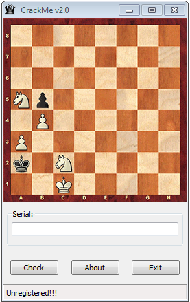
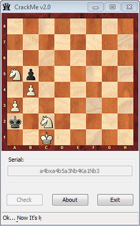

The crackme [CrackMe v2.0](http://crackmes.de/users/greedy_fly/crackme_v2.0/) by Greedy_Fly has been published April 22, 2015.
It is rated at *2 - Needs a little brain (or luck)*. The crackme is written in Assembler and runs on Windows.
The description reads:

> Hi, All...Test Your Skills... ))))
>
> Solution: Valid Serial and solution.txt
> //Don't post your solution(Serial) on the board!
> Have Fun!
> Greedy_Fly

The crackme greets us with the following user interface:

The chess board looks like a regular "White to move first and checkmate Black"-problem. The serial is probably the solution to the problem. But before trying to solve the chess problem, let's look at the disassembly first to see if we can find additional hints.

## Serial Length
The following lines read the serial, call a subroutine that I named ``length_function`` with the length of the serial as the argument, compare the result to 148224 and jump to fail if the values don't match:
    
    .text:004012E5 push    68h             ; nIDDlgItem
    .text:004012E7 push    [ebp+hWnd]      ; hDlg
    .text:004012EA call    GetDlgItem
    .text:004012EF mov     dword ptr hwnd, eax
    .text:004012F4 lea     eax, input      ; "serial"
    .text:004012FA push    eax             ; lParam
    .text:004012FB push    20h             ; wParam
    .text:004012FD push    0Dh             ; Msg
    .text:004012FF push    dword ptr hwnd  ; hWnd
    .text:00401305 call    SendMessageA
    .text:0040130A push    eax
    .text:0040130B xchg    eax, ebx
    .text:0040130C call    length_function
    .text:00401311 cmp     esi, 148224
    .text:00401317 jz      short valid_length

The routine ``length_function`` looks like that:

    .text:0040148E length_function proc near
    .text:0040148E inc     ebx
    .text:0040148F shl     ebx, 4          ; times 16
    .text:00401492 mov     esi, 64
    .text:00401497 lea     edi, [ebx+esi]  ; 16*(ebx+1)+64
    .text:0040149A imul    ebx, edi, 386   ; *386
    .text:004014A0 xor     esi, esi
    .text:004014A2 xchg    esi, ebx
    .text:004014A4 retn
    .text:004014A4 length_function endp

It calculates the following value (where *l* is the length of the serial):

$$
(16\cdot(l+1) +64)\cdot 386
$$

So we need to have:

\begin{align*}
    (16\cdot(l+1) +64)\cdot 386 &= 148224 \\
    (16\cdot(l+1) +64) &= 384 \\
    16l + 80 &= 384 \\
    l &= 19
\end{align*}

**Conclusion:** The length of the serial needs to be 19 characters.

## Hash and Check
If the length of the serial is 19 characters, we get to these instructions:

    .text:0040131B valid_length:
    .text:0040131B call    md5open
    .text:00401320 pop     ecx
    .text:00401321 push    ecx
    .text:00401322 push    offset input    ; "serial"
    .text:00401327 call    make_copy
    .text:0040132C call    hash
    .text:00401331 push    offset hex_hash ; "0B17E4358A309CC122E8856AD0FCACEC"
    .text:00401336 push    10h
    .text:00401338 push    eax
    .text:00401339 call    to_hex
    .text:0040133E lea     esi, hex_hash   ; "0B17E4358A309CC122E8856AD0FCACEC"
    .text:00401344 lea     edi, a7e9c7f1a62b7b9 ; "7E9C7F1A62B7B93F34A6A6C16BCAA840"
    .text:0040134A mov     ecx, 20h
    .text:0040134F cld
    .text:00401350 repe cmpsb
    .text:00401352 jnz     short fail

The first subroutine --- I named it ``md5open`` --- is:

    .text:00402240 md5open proc near
    .text:00402240 push    edi
    .text:00402241 xor     eax, eax
    .text:00402243 mov     offset2, eax
    .text:00402248 xor     eax, eax
    .text:0040224A mov     offset, eax
    .text:0040224F mov     edi, offset input_copy
    .text:00402254 mov     ecx, 10h
    .text:00402259 rep stosd
    .text:0040225B mov     eax, offset md5
    .text:00402260 mov     dword ptr [eax], 67452301h
    .text:00402266 mov     dword ptr [eax+4], 0EFCDAB89h
    .text:0040226D mov     dword ptr [eax+8], 98BADCFEh
    .text:00402274 mov     dword ptr [eax+0Ch], 10325476h
    .text:0040227B pop     edi
    .text:0040227C retn
    .text:0040227C md5open endp

The last four constants should look familiar: those are the 32bits used as the starting point of the MD5 calculation. Sure enough, eventually the crackme will call the following routine:

    .text:00401830 md5_0 proc near
    .text:00401830
    .text:00401830 var_30= dword ptr -30h
    .text:00401830 var_2C= dword ptr -2Ch
    .text:00401830 var_28= dword ptr -28h
    .text:00401830 var_24= dword ptr -24h
    .text:00401830 anonymous_0= qword ptr -20h
    .text:00401830
    .text:00401830 pusha
    .text:00401831 mov     esi, offset md5
    .text:00401836 mov     ebp, offset input_copy
    .text:0040183B mov     eax, [esi]
    .text:0040183D mov     ebx, [esi+4]
    .text:00401840 mov     ecx, [esi+8]
    .text:00401843 mov     edx, [esi+0Ch]
    .text:00401846 mov     edi, ebx
    .text:00401848 xor     edi, ecx
    .text:0040184A xor     edi, edx
    .text:0040184C add     eax, [ebp+0]
    .text:0040184F add     eax, edi
    .text:00401851 rol     eax, 0Bh
    .text:00401854 mov     edi, eax
    .text:00401856 xor     edi, ebx
    .text:00401858 xor     edi, ecx
    .text:0040185A add     edx, [ebp+4]
    .text:0040185D add     edx, edi
    .text:0040185F rol     edx, 0Eh
    .text:00401862 mov     edi, edx
    .text:00401864 xor     edi, eax
    .text:00401866 xor     edi, ebx
    .text:00401868 add     ecx, [ebp+8]
    .text:0040186B add     ecx, edi
    .text:0040186D rol     ecx, 0Fh
    .text:00401870 mov     edi, ecx
    .text:00401872 xor     edi, edx
    ...

This is the start of the MD5 hashing of the 64 bit value in ``input_copy``. The value of ``input_copy`` consists of the entered serial followed by the hardcoded byte 0x80, and the result of 19 times 8, i.e., 0x98, at the eighth last byte:

    .data:00404150 input_copy db 61h, 34h, 61h, 34h, 62h, 35h, 61h, 33h 
    .data:00404150 db 4Eh, 62h, 34h, 2Bh, 4Bh, 61h, 31h, 4Eh
    .data:00404150 db 62h, 33h, 23h, 80h, 0, 0, 0, 0
    .data:00404150 db 0, 0, 0, 0, 0, 0, 0, 0
    .data:00404150 db 0, 0, 0, 0, 0, 0, 0, 0
    .data:00404150 db 0, 0, 0, 0, 0, 0, 0, 0
    .data:00404150 db 0, 0, 0, 0, 0, 0, 0, 0
    .data:00404150 db 98h, 0, 0, 0, 0, 0, 0, 0

After the MD5 hashing seems to follow another hash, maybe SHA. The resulting hash is converted to a hex string by the call at offset 0x401339, and the result is compared to the hardcoded string "7E9C7F1A62B7B93F34A6A6C16BCAA840" (offset 0x401344). 

There is no way we can reverse the hash result or even brute-force the 19 character serial. So we really need to solve the chess problem. Fortunately, it is a very easy one. Here is the unique, shortest sequence of moves to get to a checkmate:

- a4
- bxa4
- b5
- a3
- Nb4+
- Ka1
- Nb3#

All that's left is to convert those move into a 19 character string. Since the above moves take 21 characters, you need to lose the check (+) and checkmate (#) indicators:

    a4bxa4b5a3Nb4Ka1Nb3

Entering this string give the goodboy messages:

