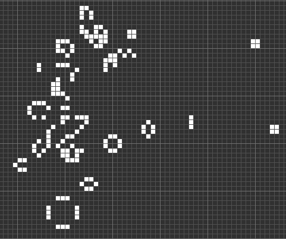

% Solution to Crackme "CrackMe 3.0" by "IamLupo"
% Johannes Bader (www.johannesbader.ch)
% 2014-11-27

This crackme was published November 13th 2014. It is rated *"3 - Getting harder"*. The description says:

> Hey everyone,

> Here again a new project i wrote. I had some new inspiration and converted it to a challange ;) This time you need to find a valid Serial key. Second is to write your own keygen.

> Good luck!

It wasn't until the crackme author *IamLupo* posted the following hint in the comments that I could solve the crackme:

> Working serial:
> Username: IamLupo
> Serial: A8G4-5rBX-hQEv-oi42

I tried a couple of ideas to come up with a working username/serial pair myself, but none of them worked. I`ll discuss the approaches in section [Validation Code]. I would be very impressed if someone can give an algorithm to solve this part of the crackme without brute-forcing. 

Solving the crackme took me the following steps, and I structured the solution accordingly:

1. First, get an overview of the code and get a general idea what is happening. This part is not too hard since there are debug information in the crackme that give speaking function names. Also, just running the crackme already reveals what is going on.

2. Reverse engineer the essential datastructure. I think this part is crucial and goes a long way towards understanding the details of the code. If you use IDA to reverse the code, I highly recommend you use its structure view.

3. Reverse engineer the code where the username and serial come into play.

4. Reverse engineer the validation code.

5. Find a valid username/serial-pair. As said before, I wasn`t able to solve this part, although I tried two approaches.

6. Write a key generator.

# Code Overview
The crackme contains a ``.bat`` file that shows how to use the crackme: ``CrackMe.exe "USERNAME" "XXXX-XXXX-XXXX-XXXX"``.  The first commandline argument is the username, the second one the serial. Running the crackme with the above parameters produces this output:

                                                     11
                                                    1  1
                                                     11

                                                             11
                                                            1  1
                                                             11

                                                                11
                                                                11

                                                                    111
                                                       111

                                                                        111

                                      11                              1
                                      1 1                             1
                                       1                              1

                                                                        111

                                                11
                                               1  1
                                                11

                                                        1
                                                        1
                                                        1

    Wrong! Try again...
    Press any key to continue . . .

The output looks like a board of *Game of Life*[^gol]. Opening the crackme in IDA confirms this; the DWARF debug information produce speaking function names, see Figure \ref{overview}.

[^gol]: http://en.wikipedia.org/wiki/Conway%27s_Game_of_Life

In pseudo-code we have:

    GameOfLife::GameOfLife(Screen)
    GameOfLife::Serial(username, serial)
    GameOfLife::Run(PlotEveryStep=False) 
        |---->  calls GameOfLife::Draw(Clear=False)
    IF GameOfLife::Check() THEN:
        // good boy
    ELSE
        // bad boy
    END IF

The crackme creates a game of life screen, then applies the username and password. After that, it runs the game (for some yet unknown number of generations) and finally checks the result. The first step to solving the crackme is to reverse the *Screen* structure, which represents the game of life cellular automaton. 

# Screen Structure
This is the structure I came up with: 

    Screen
        +0x000   width             : Int4B
        +0x004   height            : Int4B
        +0x008   nr_of_generations : Int4B 
        +0x00C   win_x             : Int4B 
        +0x010   win_y             : Int4B         
        +0x014   win_width         : Int4B 
        +0x018   win_height        : Int4B 
        +0x01C   life_min_x        : Int4B 
        +0x020   life_min_y        : Int4B 
        +0x024   life_max_x        : Int4B 
        +0x028   life_max_y        : Int4B 
        +0x02C   board             : Int4B 
        +0x030   board_copy1       : Int4B    
        +0x034   board_copy2       : Int4B 

The meaning of the members is:

- ``width`` and ``height`` are the size of the game of life board.
- ``win_x`` and ``win_y`` define the upper left corner of the visible part of the game of life board, i.e., the part that is actually printed to the commandline.
- ``win_width`` and ``win_height`` are the number of columns and rows respectively that get printed.
- ``board`` is a pointer to an array of rows of the game of life board. The rows are again arrays of bytes, where each byte defines one cell.
- ``nr_of_generations`` is the number of steps that the game of life will run before it is printed and checked.
- ``life_min_x``, ``life_min_y``, ``life_max_x`` and ``life_max_y`` are the bounding box of all life cells plus neighborhood. In Duparcs notation[^duparc] this would be the *rectangle d`ordre 1*, i.e., $R_1(C)$, where $C$ is the board. See the visualization in Figure \ref{gol_vis}.

[^duparc]: http://archive.numdam.org/ARCHIVE/ITA/ITA_1974__8_3/ITA_1974__8_3_63_0/ITA_1974__8_3_63_0.pdf

The visualization in Figure \ref{gol_vis} illustrates the structure members.  All dimensions are hardcoded. The dimension of the whole board are set inside ``GameOfLife(Screen)``:

    .text:004017DE mov     [ecx+screen.width], 1024 
    .text:004017E4 mov     [ecx+screen.height], 1024 

The dimension of the visible window are set here:

    .text:00404631 mov     [ebp+win_x], 450 
    .text:00404638 mov     edi, esp
    .text:0040463A mov     ecx, 4
    .text:0040463F mov     [ebp+win_y], 480 
    .text:00404646 lea     esi, [ebp+win_x]
    .text:00404649 mov     [ebp+win_width], 75 
    .text:00404650 mov     [ebp+win_height], 50 

The bounding box is harder to find and understand. It is set in ``Serial(username, serial)``, I`ll come back to this in section [Initial Board]:

    .text:00402349 mov     [eax+screen.life_min_x], 499
    .text:00402350 mov     [eax+screen.life_min_y], 499
    .text:00402357 mov     [eax+screen.life_max_x], 515
    .text:0040235E mov     [eax+screen.life_max_y], 507

In summary, the dimensions are:

- ``width``: 1024
- ``height``: 1024
- ``win_x``: 450 
- ``win_y``: 480
- ``win_width``: 75
- ``win_height``: 50
- ``life_min_x``: 499
- ``life_min_y``: 499
- ``life_max_x``: 515
- ``life_max_y``: 507 

# Initial Board
Now that we know how the board is set up, let`s analyse ``GameOfLife::Serial``. We know the function takes the username as the first argument, and the serial as the second:

    .text:00404614 mov     esi, [ecx]
    .text:00404616 mov     ebx, [ecx+4]    ; argv
    .text:00404619 call    ___main
    ...
    .text:00404661 mov     eax, [ebx+argv.serial]
    .text:00404664 lea     ecx, [ebp+screen]
    .text:00404667 sub     esp, 10h
    .text:0040466A mov     [esp+4], eax
    .text:0040466E mov     eax, [ebx+argv.username]
    .text:00404671 mov     [esp], eax
    .text:00404674 call    __ZN10GameOfLife6SerialEPKcS1_ ; GameOfLife::Serial(char const*,char const*)

The routine ``GameOfLife::Serial`` has four parts:

1. The ``serial`` is used to scramble a hardcoded array ``data_start``.
2. The ``serial`` is used to define the ``nr_of_generations``.
3. The ``username`` is used to scramble the result from 1
4. The resulting array is converted to life and death on the game of life board.

## Applying the serial

The code snippet shown in Figure \ref{serial1} converts the characters of the serial to numbers. Let $c$ be the serial character, then the mapping in \ref{serial1} produces the number $n$ (stored in ``ecx``) according to: 

$$
n = f(c) = \begin{cases} 
c - 39 &\mbox{if } c \mbox{ is lowercase} \\ 
c - 53 &\mbox{if } c \mbox{ is uppercase} \\ 
c - 47 &\mbox{if } c \mbox{ is a digit} \\ 
\mbox{skip}      &\mbox{if } c \mbox{ is "-"} \\ 
0 & \mbox{otherwise}
\end{cases}
$$

*skip* indicates, that all "-" in the serial will be skipped over and not used in the next step. In all other cases, the number $n$ is used to modify the array ``data_start``:

    .text:004021E2 mov     eax, ecx
    .text:004021E4 mov     ebx, ecx
    .text:004021E6 and     eax, 1
    .text:004021E9 xor     [esp+edx+8Ch+initial_data], al
    .text:004021ED and     [esp+edx+8Ch+initial_data], 1
    .text:004021F2 lea     eax, [edx+1]
    .text:004021F5 shl     ebx, 1Eh
    .text:004021F8 shr     ebx, 1Fh
    .text:004021FB xor     [esp+eax+8Ch+initial_data], bl
    .text:004021FF mov     ebx, ecx
    .text:00402201 and     [esp+eax+8Ch+initial_data], 1
    .text:00402206 shl     ebx, 1Dh
    .text:00402209 lea     eax, [edx+2]
    .text:0040220C shr     ebx, 1Fh
    .text:0040220F xor     [esp+eax+8Ch+initial_data], bl
    .text:00402213 mov     ebx, ecx
    .text:00402215 and     [esp+eax+8Ch+initial_data], 1
    .text:0040221A shl     ebx, 1Ch
    .text:0040221D lea     eax, [edx+3]
    .text:00402220 shr     ebx, 1Fh
    .text:00402223 xor     [esp+eax+8Ch+initial_data], bl
    .text:00402227 mov     ebx, ecx
    .text:00402229 and     [esp+eax+8Ch+initial_data], 1
    .text:0040222E shl     ebx, 1Bh
    .text:00402231 lea     eax, [edx+4]
    .text:00402234 shr     ebx, 1Fh
    .text:00402237 xor     [esp+eax+8Ch+initial_data], bl
    .text:0040223B and     [esp+eax+8Ch+initial_data], 1
    .text:00402240 lea     ebx, [edx+5]
    .text:00402243 add     edx, 6
    .text:00402246 shl     ecx, 1Ah
    .text:00402249 shr     ecx, 1Fh
    .text:0040224C xor     [esp+ebx+8Ch+initial_data], cl
    .text:00402250 and     [esp+ebx+8Ch+initial_data], 1

This code uses the 6 least significant bits of the number $n$ to XOR 6 bytes in ``data_start``, starting with the first 6 bits in ``data_start`` and moving ahead 6 bytes for each character in the serial (except for characters "-" which are just ignored).
For example, let the serial start with ``"c3..."``. The character ``c`` is lowercase with ASCII code 99. According to the definition of $f(c)$ we need to subtract 39, which gives the value $n=30$. Similarly we get $n=4$ for the character $c="3"$. The array  ``data_start`` is hardcoded to: 

    data_start =  [1, 1, 1, 0, 0, 0, 0, 0, 1, 1, 0, 0,...]

The two characters "c3" of the serial XOR this array as shown in Figure \ref{serial2}

## Calculating the number of generations
From the ``run.bat`` we know the serial format is:

    XXXX-XXXX-XXXX-XXXX

The array ``data_start`` has 84 bytes. It therefore takes 84/6 = 14 characters of the serial (not counting "-") to scramble the data. This leaves us two characters that are used to calculate the number of generations with the code block shown in Figure \ref{serial3}

This boils down to:

$$
\text{nr of generations} = f(c_{18}) + 64*f(c_{19}) 
$$

where $c_{18}$, and $c_{19}$ are the last two characters of the serial. At the end of the ``Serial``-Routine we find:

    .text:00402412                 cmp     ebp, 49         ; if nr_of_generations < 50:
    .text:00402412                                         ;    nr_of_generations = 50
    .text:00402415                 jg      short loc_402422
    .text:00402417                 mov     eax, [esp+8Ch+screen]
    .text:0040241B                 mov     [eax+screen.nr_of_generations], 32h
    .text:00402422
    .text:00402422 loc_402422:  

This sets ``nr_of_generations`` to 50 if it was smaller. This means, our game of life will run for at least 50 generations, but it can run for much longer. If, for instance, the serial ends with "zz", then the nr of generations is:

$$
\text{nr of generations} = f("z") + 64*f("z") = 83 + 64*83 = 5395
$$

## Applying the username
The username is applied to the ``data_start`` array very similar to the serial, see Figure \ref{username1}. Instead of taking just 6 bits per character, this time the entire 8 bits of the characters are used to set 8 bytes in ``data_start``. The code iterates over all username characters, but at most 10, so at the most this sets the first 80 of the 84 bytes of ``data_start``. The XORing works as for the serial. 

## Convert the array to the game of life board
Finally, the code converts the 84 bytes in ``data_start`` to the game of life board in ``screen.board``, see Figure \ref{convert1}. It does it by filling in rows of 14 cells, starting with cell (500,500). For example, 

For example, if ``data_start`` is:

    [1, 1, 1, 1, 0, 1, 1, 1, 0, 0, 1, 1, 0, 0, 
    0, 0, 0, 1, 0, 1, 1, 0, 0, 0, 1, 0, 0, 1, 
    1, 0, 1, 0, 1, 0, 0, 0, 0, 1, 1, 1, 0, 1, 
    0, 1, 1, 0, 0, 1, 0, 0, 1, 0, 0, 1, 1, 1, 
    0, 0, 1, 0, 0, 0, 1, 0, 1, 0, 0, 0, 0, 1, 
    1, 1, 1, 1, 1, 0, 1, 1, 1, 0, 1, 1, 0, 1]

we get the board:
                                                                           
    XXXX XXX  XX             
       X XX   X  X           
    X X X    XXX X           
     XX  X  X  XXX           
      X   X X    X           
    XXXXX XXX XX X           
                       
This is also why ``life_min_x``, ``life_min_y``, ``life_max_x``, and ``life_max_y`` are set to 499,499, 515, and 507: this is the rectangle around the above pattern plus one space neighborhood.

# Validation Code

After the game of life board is initialized according to the previous section an run for ``screen.nr_of_generations``, the result is compared to a hardcoded pattern, see Figure \ref{validate}. The hardcoded result is stored in ``GameOfLife::Check()::temp_grid``, it can be found in the resource section of the exe:

    .rdata:004060C0 __ZZN10GameOfLife5CheckEvE9temp_grid

Only the visible part of the board is checked, i.e., the 50x75 window. This part of the board is compared row by row to the ``temp_grid`` array. The desired end state is shown in Figure \ref{desired}. 

# Valid serial/username combinations
Now we know how the serial and username affect the initial board, and how the board should look like after 50 or more generations. The problem know is to find a initial board that produces the desired pattern in Figure \ref{desired}. This is as surprisingly hard problem and I wasn't able to solve it. I tried:

- Using a simple simulated annealing optimization on the initial 84 cells. This didn't work at all, because flipping a single cell in the initial state has huge effects after 50 or more generations.

- Using  Duparc algorithm[^duparc] to reverse the final state. The problem here is that there are a huge number of antecssors and even if you take the correct one by chance, there is very little hope that you can reverse 50 steps without once taking the wrong previous state.

- I briefly looked at other approaches working with probabilies, e.g., simulating different 5x5 patterns, but implementing that would take a lot of time and I'm not sure it would work.

I therefore asked the crackme author *IamLupo* for clues, and he released a valid username/serial combo. Given this information it is straightforward to write a keygen using the information we got in Section [Initial Board]

# Keygen
Since we have a known username/serial pair, we can write a keygen that generates the same pattern, and therefore will lead to the same initial board.  The username and serial are both applied to the intial board with XOR operations. This means we can reverse the order, i.e., first apply the username, then find a serial that XORs to the correct pattern. The following keygen does exactly that:

    import argparse
    import random
    import re
    import string

    def number_to_binary_little_endian(nr):
        b = [int(x) for x in list(bin(nr)[:1:-1])]
        b = b + (8-len(b))*[0]
        return b

    def f(c):
        if c in string.ascii_lowercase:
            n = ord(c) - 59
        elif c in string.ascii_uppercase:
            n = ord(c) - 53
        elif c in string.digits:
            n = ord(c) - 47
        elif c == "-":
            return None
        else:
            n = 0
        return n

    def f_rev(n):
        ok = []
        reversers = {59: string.ascii_lowercase, 53: string.ascii_uppercase,
                47: string.digits}

        for v, f in reversers.items():
            try:
                c = chr(n + v)
                if c in f: 
                    ok.append(c)
            except ValueError:
                pass

        return ok

    def add_serial(data, serial):
        if not re.match(".{4}-.{4}-.{4}-.{4}", serial):
            print("serial needs to have format XXXX-XXXX-XXXX-XXXX chars")
            quit()
        offset = 0
        nr_generations = 0
        for i,c in enumerate(serial):
            n = f(c)
            if n is None:
                continue

            if i < 17:
                mask = number_to_binary_little_endian(n)
                for m in mask[:6]:
                    data[offset] ^= m
                    offset += 1
            elif i == 17:
                nr_generations += n
            elif i == 18:
                nr_generations += n*64

        nr_generations = max(nr_generations, 50)
        return nr_generations

    def add_username(data, username):
        offset = 0
        for u in username:
            b = number_to_binary_little_endian(ord(u))
            for i, bb in enumerate(b):
                data[offset+i] ^= bb
            offset += 8
            if offset >= 8*10:
                return 

    def calc_pattern_and_nr_of_gen(username, serial):
        data =  84*[0]
        nr_gens = add_serial(data, serial)
        add_username(data, username)
        return data, nr_gens

    def calc_serial(pattern, nr_gen, username):
        """ first the pattern """
        data =  84*[0]
        add_username(data, username)
        serial_pattern = [p ^ d for p,d in zip(pattern, data)]
        serial = ""
        for i in range(0,84,6):
            pat = serial_pattern[i:i+6]
            pat_str = ''.join([str(p) for p in pat])
            pat_int = int(pat_str[::-1],2)
            candidates = f_rev(pat_int)
            if not candidates:
                return "SORRY, can't find a serial for you"
            c = random.choice(candidates)
            serial += c
            if i/6 % 4 == 3:
                serial += "-"

        """ finally nr of generations """
        for b in range(nr_gen//64+1):
            a = nr_gen - b*64
            acand = f_rev(a)
            bcand = f_rev(b)
            if acand and bcand:
                serial += random.choice(acand)
                serial += random.choice(bcand)
                return serial
        return "SORRY, can't get nr of generations right"
        
    def keygen(username):
        known_username = "IamLupo"
        known_serial = "A8G4-5rBX-hQEv-oi42"
        pattern, nr_gen = calc_pattern_and_nr_of_gen(known_username, known_serial)
        return calc_serial(pattern, nr_gen, username)

    if __name__=="__main__":
        parser = argparse.ArgumentParser("Keygen for IamLupo's Crackme 3.0")
        parser.add_argument("username")
        args = parser.parse_args()
        print("serial is: {}".format(keygen(args.username)))

For example:

    $ python keygen.py sheldon
    serial is: qhG6-anwY-gQEv-oi42

