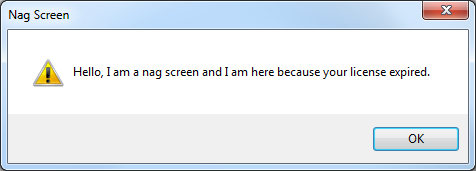
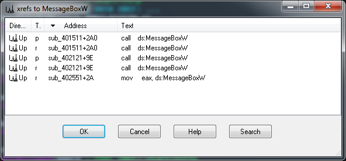
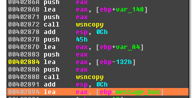
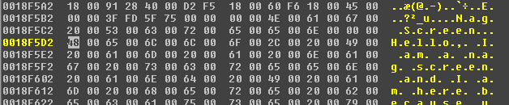
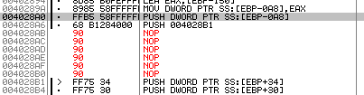
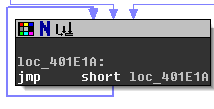
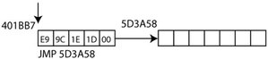
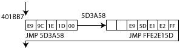

# Solution to KeygenMe V7 by MaxXor 
author: baderj (www.johannesbader.ch)

Crackme Infos:

- name: KeygenMe V7 
- author: MaxXor 
- published: 2014-09-09
- difficulty: 3 - Getting harder
- plattform: Windows
- language: C/C++
- link: http://www.crackmes.de/users/maxxor/keygenme_v7/

Description:

    Information:
    ============
    - platform: Windows
    - language: C
    - protection: find it out
    - misc: Antivirus/Sandbox may not like it

    Goals:
    ======
    GOLD: * create a working keygen
    * remove the nag screen

    SILVER: * get a working username/serial combination
    * remove the nag screen

    BRONZE: * make it accept every username/serial combination
    * remove the nag screen

    WOOD: * remove the nag screen || make it accept every 
    username/serial combination

    Good luck and happy reversing!
    MaxX0r

## Wood

As expected, running the crackme shows the nag screen in Figure \ref{nag}. Unfortunately, neither the message box title *"Nag Screen"* nor the message *"Hello, I am ..."* are stored as is and therefore don't appear in the list of referenced strings in IDA or OllyDbg. We need another way to locate the code responsible for the nag screen. Since the screen looks like a standard Windows message box. Search in IDA Pro for ``MessageBoxW`` Imports, and list all references (see Figure \ref{references}).

There are 3 subroutines that call or reference ``MessageBoxW``:

- sub_401511
- sub_402121
- sub_402551

Set breakpoints at all three offsets and run the crackme. The code should stop inside ``sub_402551`` - so this is probably the subroutine that creates the nag screen. The message box in ``sub_402121`` is clearly the "About" box::

    .text:004021B0    push    40h             ; uType
    .text:004021B2    push    offset Caption  ; "About"
    .text:004021B7    push    offset Text     ; "KeygenMe V7\n========================\nRe"...
    .text:004021BC    push    [ebp+hWnd]      ; hWnd
    .text:004021BF    call    ds:MessageBoxW

The remaining message box in ``sub_401511`` does never show up, regardless of what buttons you press. So this box might be related to the good boy message that you only see when you enter a correct serial. More on that in the later when trying to find the key validation routine. To confirm that ``sub_401551`` shows the nag screen, notice that  

    .text:0040257B mov     eax, ds:MessageBoxW
    .text:00402580 mov     [ebp-150h],

stores a reference to ``MessageBoxW`` at ``[ebp-150h]``, I renamed this location to ``message_box``. Next follow a lot of ``mov`` lines that seem to build a byte array, followed by two ``wsncopy`` calls that copy the results to ``var_148`` and ``var_A4`` (see Figure \ref{fig2}).

Set a break point at ``00402894`` to check the content of those two locations, you should see the title and message of the nag screen at ``[ebp-148h]`` and ``[ebp-4Ah]`` (see Figure \ref{fig3}). This confirms that we found the nag screen. To disable it, look at the end of ``sub_401551``: 

    .text:004028AB push    offset sub_401469
    .text:004028B0 retn

These lines jump to ``sub_401469``, this subroutine features a sequence of calls to Windows functions:

    .text:0040147F call    ds:GetCurrentProcessId
    ...
    .text:004014A9 call    esi ; VirtualAllocEx
    ...
    .text:004014BC call    esi ; VirtualAllocEx
    ...
    .text:004014BE mov     esi, ds:WriteProcessMemory
    ...
    .text:004014D4 call    esi ; WriteProcessMemory
    ...
    .text:004014E4 call    esi ; WriteProcessMemory
    ...
    .text:004014F2 call    ds:CreateRemoteThread
    ...
    .text:00401504 call    ds:Sleep

Those are mostly thread/process related functions that run the message box in a new thread (so it doesn't block the GUI). Avoiding the call to ``sub_401469`` should therefore prevent the nag screen. To avoid the call, simply replace ``.text:004028AB``, and ``.text:004028B0`` with ``NOP``. I used OllyDbg to patch the executable:

- Jump to 004028AB with ``Shift+G``
- Highlight the two lines and press ``Space``
- Enter ``NOP`` and press ``Assemble``. Make sure you check ``Keep size`` and ``Fill rest with NOPs`` (see Figure \ref{patch}).
- Right click inside the CPU view and choose ``Edit`` -> ``Copy all modifications to Executable``.
- Close OllyDbg, you should be prompted to save the modified exe.

If you run the patched exe, the nag screen is gone!

## Gold
I skipped Bronze and Silver and went for the keygen. First we need to find the serial validation routine. I tried two paths sucessfully:

### First Path
Look at ``sub_401511``. From *Wood* we know that there is a *MessageBox* call inside this subroutine, which is neither the *nag screen* nor the *About* message box. So this message box probably shows the "good boy" message. The subroutine also obfuscates the message like we saw for the nag screen. There is only one caller to ``sub_401511``, which is ``sub_401856``. This is the key validation routine.

### Second Path
The serial is probably tested when you press the ``Register`` button. Button presses are registered by the ``WindowProc`` callback function. We can find this subroutine by looking for other GUI related calls like ``GetDlgItemTextW``, or by checking the prototypes of the function. While the actual name of WindowProc is defined by the application, the parameters are always the same, and IDA Pro should be able to correctly name those parameters. There is only one subroutine that matches the prototype of ``WindowProc``

    int __stdcall sub_402121(HWND hWnd, UINT Msg, int wParam2, LPARAM lParam)

These are the first few lines of sub_402121 (WindowProc): 

    .text:00402121                 push    ebp
    .text:00402122                 mov     ebp, esp
    .text:00402124                 sub     esp, 64h
    .text:00402127                 push    esi
    .text:00402128                 push    edi
    .text:00402129                 mov     eax, [ebp+Msg]
    .text:0040212C                 mov     [ebp+var_C], eax
    .text:0040212F                 mov     eax, [ebp+var_C]
    .text:00402132                 mov     [ebp+message], eax
    .text:00402135                 sub     [ebp+message], 1
    .text:00402139                 jz      loc_40235A
    .text:0040213F                 sub     [ebp+message], 1
    .text:00402143                 jz      loc_402516
    .text:00402149                 sub     [ebp+message], 0Eh
    .text:0040214D                 jz      loc_402528
    .text:00402153                 sub     [ebp+message], 101h ; => 111h = WM_COMMAND
    .text:0040215A                 jz      short loc_402161
    .text:0040215C                 jmp     loc_402533

The jump in ``text:0040215A`` is taken if the ``Msg`` is ``111h``, which is ``WM_COMMAND`` (triggered when the register button is pressed for example). If ``Msg = 1``, then the window is created. Follow this trail leads to those lines:

    .text:0040216C                 cmp     eax, 104        ; Register button
    .text:0040216F                 jnz     short loc_40218E
    .text:00402171                 mov     eax, [ebp+wParam2] ; Register button pressed
    .text:00402174                 shr     eax, 16         ; eax = 0000xxxx
    .text:00402177                 and     eax, 0FFFFh     ; eax = 0
    .text:0040217C                 movzx   eax, ax         ; eax still 0
    .text:0040217F                 test    eax, eax        ; zf = 1 (always)
    .text:00402181                 jnz     short loc_40218E ; never taken
    .text:00402183                 push    offset loc_40218E
    .text:00402188                 push    offset sub_401856
    .text:0040218D                 retn

104 is the unique identifier for the register button, it was set when the button was created:

    .text:00402419                 push    eax             ; hInstance
    .text:0040241A                 push    104             ; hMenu
    .text:0040241C                 push    [ebp+hWnd]      ; hWndParent
    .text:0040241F                 push    1Ah             ; nHeight
    .text:00402421                 push    78h             ; nWidth
    .text:00402423                 push    46h             ; Y
    .text:00402425                 push    0Ah             ; X
    .text:00402427                 push    50000000h       ; dwStyle
    .text:0040242C                 push    offset aRegister ; "Register"a
    .text:00402436                 push    0               ; dwExStyle
    .text:00402438                 call    ds:CreateWindowExW

If the callback is triggered by the register button we reach these lines:

    .text:00402188                 push    offset sub_401856
    .text:0040218D                 retn

So the key validation is likely in ``sub_401856``. 

Translating ``sub_401856`` to a keygen is straightforward, except for three very interesting obstacles.

### 1. Self-Modifying Code

The key validation has a couple of strange code sequences, for instance an infinite loop (see Figure \ref{loop}) or byte sequences that could be disassembled to meaningful code: 

    .text:00401BB7 unk_401BB7      db 0EBh ; d             ; CODE XREF: key_validation+364j
    .text:00401BB7                                         ; DATA XREF: key_validation+250o
    .text:00401BB8                 db 0FEh ; ¦

These locations are modified during runtime, as you can see when you run a debugger. Let's take ``401BB7`` as an example, there are two other code modifications that work the same way. With calls to ``HeapAlloc`` and ``VirtualProtect``, 7 bytes are allocated and made writeable and executable:

    .text:00401AA6                 mov     [ebp+var_90], offset unk_401BB7
    .text:00401AB0                 mov     eax, [ebp+var_90]
    .text:00401AB6                 mov     [ebp+l_401BB7], eax
    .text:00401AB9                 push    7               ; dwBytes
    .text:00401ABB                 push    8               ; dwFlags
    .text:00401ABD                 call    ds:GetProcessHeap
    .text:00401AC3                 push    eax             ; hHeap
    .text:00401AC4                 call    ds:HeapAlloc
    .text:00401ACA                 mov     [ebp+new_code], eax
    .text:00401ACD                 lea     eax, [ebp+flOldProtect]
    .text:00401AD3                 push    eax             ; lpflOldProtect
    .text:00401AD4                 push    40h             ; flNewProtect
    .text:00401AD6                 push    7               ; dwSize
    .text:00401AD8                 push    [ebp+new_code]  ; lpAddress
    .text:00401ADB                 call    ds:VirtualProtect

An additional ``VirtualProtect`` call also makes ``401BB7`` executable and writable:

    .text:00401AE1                 lea     eax, [ebp+flOldProtect]
    .text:00401AE7                 push    eax             ; lpflOldProtect
    .text:00401AE8                 push    40h             ; flNewProtect
    .text:00401AEA                 push    5               ; dwSize
    .text:00401AEC                 push    [ebp+l_401BB7]  ; lpAddress
    .text:00401AEF                 call    ds:VirtualProtect

The first byte of 401BB7 is set to ``E9``, this is the opcode for ``JMP``:

    .text:00401B47                 push    0E9h
    .text:00401B4C                 push    [ebp+l_401BB7]
    .text:00401B4F                 call    memset

The bytes at offset 1 to 5 into 401BB7 are set next:

    .text:00401B58                 mov     eax, [ebp+l_401BB7]
    .text:00401B5B                 add     eax, 5
    .text:00401B5E                 mov     ecx, [ebp+new_code]
    .text:00401B61                 sub     ecx, eax
    .text:00401B63                 mov     [ebp+var_54], ecx
    .text:00401B66                 push    4
    .text:00401B68                 lea     eax, [ebp+var_54]
    .text:00401B6B                 push    eax
    .text:00401B6C                 mov     eax, [ebp+l_401BB7]
    .text:00401B6F                 inc     eax
    .text:00401B70                 push    eax
    .text:00401B71                 call    memcpy

They are set to the value of ``(&new_loc - &l_401BB7 - 5)``, this is the difference between the offset of ``l_401BB7`` and the newly allocated space at ``new_loc``, minus 5 which is the size of the ``JMP`` instruction. This creates a jump instruction to the newly allocated heap space. Figure \ref{step1} shows the jump to the location on the heap.

``E9`` stands for ``JMP``, the following four bytes 0x1D1E9C are equal to 0x5D3A58 - 0x401BB7 - 5. (0x5D3A58 is the address of the allocated heap space). Similar bytes are placed at bytes 2 to 6 of the heap space:

    .text:00401B7C push    0E9h
    .text:00401B81 mov     eax, [ebp+new_code]
    .text:00401B84 inc     eax
    .text:00401B85 inc     eax
    .text:00401B86 push    eax
    .text:00401B87 call    memset
    .text:00401B8D add     esp, 12
    .text:00401B90 mov     eax, [ebp+l_401BB7]
    .text:00401B93 add     eax, 5
    .text:00401B96 mov     ecx, [ebp+new_code]
    .text:00401B99 add     ecx, 7
    .text:00401B9C sub     eax, ecx
    .text:00401B9E mov     [ebp+var_54], eax
    .text:00401BA1 push    4
    .text:00401BA3 lea     eax, [ebp+var_54]
    .text:00401BA6 push    eax
    .text:00401BA7 mov     eax, [ebp+new_code]
    .text:00401BAA add     eax, 3
    .text:00401BAD push    eax
    .text:00401BAE call    mem

This again creates a ``JMP`` instruction (opcode ``E9``), with relative address
set to (&l_401BB7 + 5) - (&new_loc + 7), or (0x401BB7 + 5) - (0x5D3A58 + 7) in our example. This creates a jump back to the instruction following the one after the ``JMP`` instruction at ``401BB7`` (see Figure \ref{step2}). Finally, the two first bytes of the new location are set:

    .text:00401B18 push    1
    .text:00401B1A mov     eax, [ebp+var_48]
    .text:00401B1D movzx   eax, [ebp+eax*2+var_4C]
    .text:00401B22 push    eax
    .text:00401B23 mov     eax, [ebp+new_code]
    .text:00401B26 add     eax, [ebp+var_48]
    .text:00401B29 push    eax
    .text:00401B2A call    m

The value is obfuscated with ``sub_402B3C``, but comes out as ``0F 31``, which is the opcode for ``rdtsc``, which reads the time stamp counter (see Figure \ref{step3}).  

One of the three self code modifications uses 8 bytes heap space, and instead of ``rdtsc`` it creates ``83 C0 21``, which is ``add eax 0x21``. The jumps to and from this instruction are created the same way.

### 2. Anti Debugging
The self modifying part created a ``rdtsc`` call. The return value of this call (in ``var_78``) is used later:

    .text:00401F2D rdtsc
    .text:00401F2F sub     eax, [ebp+var_78]
    .text:00401F32 cmp     eax, 70000h
    .text:00401F37 jbe     short loc_401F3C
    .text:00401F39 dec     [ebp+var_C]
    .text:00401F3C
    .text:00401F3C loc_401F3C:                             ; CODE XREF: key_validation+6E1j
    .text:00401F3C mov     eax, [ebp+var_10]

This checks if the number of CPU cycles between the first call of ``rdtsc`` and a second call in 401F2D is greater than 0x70000h. This number of cycles is only reached if there is a breakpoint between the two ``rdtsc`` calls. If there is a breakpoint slowing down the execution, then the instruction ``dec [ebp+var_C]`` messes with the key validation routine.

### 3. API hook CharUpperW
There are a couple of calls to ``CharUpperW``: 

    .text:0040192A call    ds:CharUpperW

The expected behaviour of this windows API function is to convert a string or character to uppercase. Howerver, if you step into ``CharUpperW`` you'll notice an API hook:

    USER32:755AF350 user32_CharUpperW:
    USER32:755AF350 jmp    sub_4017BE

The subroutine ``sub_4017BE`` does convert letters to uppercase, but for digits it performs a mapping, i.e., 0 to 5, 1 to 7, 2 to 4, 3 to 1, 4 to 0, 5 to 9, 6 to 8, 7 to 3, 8 to 2, 9 to 6.

## Keygen

### Key Validation Algorithm

If you figured out the obstacles discussed in the previous section it just takes patience to disassemble the key validation code. Here is my representation in Python:

    def string_to_ascii_codes(string, zerobytes=0):
        return [ord(c) for c in string] + zerobytes*[0]

    def pseudo_upper(string):
        mapping = [str(c) for c in [5,7,4,1,0,9,8,3,2,6]]
        s = string.upper()
        r = ""
        for c in s:
            if "0" <= c <= "9":
                r += mapping[int(c)]
            else:
                r += c
        return r

    def validate(user, serial):
        if len(user) < 3:
            return("ERROR: user needs at least 3 characters")
        if len(user) > 16:
            return("ERROR: user has more than 16 characters")
        if len(serial) != 32:
            return("ERROR: serial needs to have 32 characters")

        v5 = "0123456789ABCDEFGHIJKLMNOPQRSTUVWXYZ"
        validity = 0
        check_var = -1
        this_is_var1 = 0
        byte_403020 = 1

        serial = pseudo_upper(serial)
        
        user_ascii = string_to_ascii_codes(user)
        serial_ascii = string_to_ascii_codes(serial)

        four_bytes = 2**32
        lower = 0
        upper = 0
        for i1, ua in enumerate(user_ascii):
            lower += i1*(lower // (i1 + 8) + i1*ua)
            upper += (lower // four_bytes)
            lower %= four_bytes
            upper += user_ascii[i1] 
        if lower < 1000:
            lower = lower**2

        v1 = len(user)
        j = upper
        j = j ^ v1
        j = (15*j + 1)//16
        while j >= 36:
            j -= 7

        ok_flag = False
        valid_serial = ""
        for k in range(32):
            if not k or k % 7: # all except k=7, k=14, k=21
                if 33 % (k + 2) and k % 4:
                    # E1A
                    feight = lower // (35 - k) + 1337
                    feight = lower // feight
                    feight = feight % (k + 1)
                    feight = (15*feight + 1) // (j//2 + 1)
                    serial_ascii[k] = ord(pseudo_upper(serial[k]))
                    serial = "".join([chr(c) for c in serial_ascii]) 
                    if check_var != -1 and check_var == feight:
                        feight *=2
                    while feight > 36:
                        feight -= 2 
                    while feight < 0:
                        feight += 2
                else:
                    feight = lower // (k + j) + 1337
                    feight = lower // feight
                    feight = feight ^ (k + 1) 
                    serial_ascii[k] = ord(pseudo_upper(serial[k]))
                    serial = "".join([chr(c) for c in serial_ascii]) 
                    feight = (15*feight + 1) // (j//2 + 1)
                    if check_var != -1 and check_var == feight:
                        feight *=2
                    while feight >= 34:
                        feight -= 2 
                    while feight < 0:
                        feight += 2
                check_var = feight
                ok_flag = (serial[k] == v5[feight])
                if not ok_flag: 
                    break
                validity += 1
            else:
                ok_flag = (serial[k] == "-")
                valid_serial += "-"
                if not ok_flag: 
                    break
                ok_flag = True
                validity += 1

        byte_403020 = 0
        if ok_flag:
            print("valid serial")
        else:
            print("invalid serial")

### The Keygen
Writing a keygen is straightforward, just make sure to properly reverse the strange upper-case function that the crackme is using:

    import argparse

    def double_reverse(string):
        mapping = [str(c) for c in [2,7,6,1,8,4,5,3,9,0]]
        s = string.upper()
        r = ""
        for c in s:
            if "0" <= c <= "9":
                r += mapping[int(c)]
            else:
                r += c
        return r

    def keygen(user):
        if len(user) < 3:
            return("ERROR: user needs at least 3 characters")
        if len(user) > 16:
            return("ERROR: user has more than 16 characters")

        v5 = "0123456789ABCDEFGHIJKLMNOPQRSTUVWXYZ"
        check_var = -1
        four_bytes = 2**32
        lower, upper = 0, 0
        for i1, u in enumerate(user):
            ua = ord(u)
            lower += i1*(lower // (i1 + 8) + i1*ua)
            upper += (lower // four_bytes)
            lower %= four_bytes
            upper += ua 
        if lower < 1000:
            lower = lower**2

        v1 = len(user)
        j = upper
        j = j ^ v1
        j = (15*j + 1)//16
        while j >= 36:
            j -= 7

        valid_serial = ""
        for k in range(32):
            if not k or k % 7: 
                flag = (33 % (k + 2) and k % 4)
                if flag: 
                    index = lower // (35 - k) 
                else:
                    index = lower // (k + j) 
                index += 1337
                index = lower // index
                if flag:
                    limit = 37
                    index = index % (k + 1)
                else:
                    limit = 34
                    index = index ^ (k + 1) 
                index = (15*index + 1) // (j//2 + 1)
                if check_var != -1 and check_var == index:
                    index *=2
                while index >= limit:
                    index -= 2
                while index < 0:
                    index += 2
                valid_serial += double_reverse(v5[index])
                check_var = index
            else:
                valid_serial += "-"

        return valid_serial

                

    if __name__=="__main__":
        parser = argparse.ArgumentParser("Keygen")
        parser.add_argument("user")
        args = parser.parse_args()
        user = args.user
        serial = keygen(user)
        print("user:   {}".format(user))
        print("serial: {}".format(serial))

Example Output:

    $ python keygen.py sheldon_cooper
    user:   sheldon_cooper
    serial: OW22V14-XX29W5-6XFEDW-A0W935-81K

