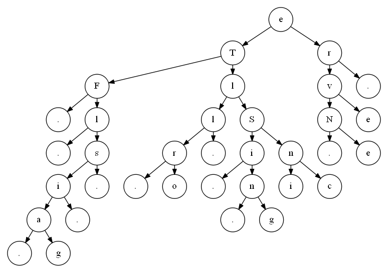

As mentioned in the README, the crackme uses a binary tree. This becomes also obvious if you look at the DWARF debug information that are left in the crackme. The tree consists of 23 nodes. Each node has the following structure:

    node
        +0x00   trash_1     : random value (from _troll)
        +0x04   left        : pointer to left node
        +0x08   enc_letter  : value of the node (a letter)
        +0x0C   index       : the index of the letter in the original
                              sentence. this value is not available
        +0x10   right       : pointer to right node
        +0x14   trash_2     : random value (from _troll)

## Troll 

The values ``trash_1`` and ``trash_2`` are set by calls to ``_troll`` at offset 0x00401735 and 0x0040175B. The ``_troll`` function gets two parameters. The first argument (called *a*) is 18i and 9i respectively, where *i* is the current node nr. The second argument (called *b*) is a random value. The random number generator is seeded with the current time, so the values can be considered unpredictable:

    .text:004016E2 mov     dword ptr [esp], 0 ; time_t *
    .text:004016E9 call    _time
    .text:004016EE mov     [esp], eax      ; unsigned int
    .text:004016F1 call    _srand

To summarize, this is the code in the block starting at offset 0x004016FF in Pseudo-code:

    for ( i = 0; i <= 23; ++i )
    {
        ptr[i] = (pTREE)malloc(0x18u);           // create an empty node
        ptr[i]->trash_1 = troll(18 * i, rand()); // set trash values
        ptr[i]->trash_2 = troll(9 * i, rand());
    }

Next let's have a look at the ``troll``-subroutine. First, there is a call to check if a debugger is present:

    .text:0040134B call    _IsDebuggerPresent@0
    .text:00401350 test    eax, eax
    .text:00401352 jz      short debugger_present

If a debugger is detected, you might see a message box titled "LOL" with message 

> Maybe the flag is calculated in this weird function

If you plan on debugging the subroutine, make sure to use anti-anti-debugging techniques. For example, just patch away the call:

    .text:0040134B xor     eax, eax
    .text:0040134D nop
    .text:0040134E nop
    .text:0040134F nop
    .text:00401350 test    eax, eax
    .text:00401352 jz      short debugger_present

Apart from the debugger check, the subroutine ``troll`` actually just calculates

$$
(4\cdot((b + a) \oplus b) \otimes 0x40 \vee 0x47) + b + a + 17
$$

Since *b* is an unpredictable random value, the return value of *troll* is unpredictable too. 

## The Tree
After the 23 nodes are initialized, we enter the block at offset 0x0040176C. The block first sets the ``enc_letter`` member of all 23 nodes: 

    .text:0040176C mov     eax, [ebp+ptr]
    .text:0040176F mov     byte ptr [eax+8], 'e'
    .text:00401773 mov     eax, [ebp+ptr+4]
    .text:00401776 mov     byte ptr [eax+8], 'r'
    .text:0040177A mov     eax, [ebp+ptr+8]
    .text:0040177D mov     byte ptr [eax+8], 'T'
    .text:00401781 mov     eax, [ebp+ptr+0Ch]
    .text:00401784 mov     byte ptr [eax+8], 'l'
    ...

Which decompiles to:

    ptr[0]->enc_letter = 'e';
    ptr[1]->enc_letter = 'r';
    ptr[2]->enc_letter = 'T';
    ptr[3]->enc_letter = 'l';
    ptr[4]->enc_letter = 'S';
    ptr[5]->enc_letter = 'v'
    ...

After the ``enc_letter``-members are set, the tree is built by setting the ``left`` and ``right`` pointer of the nodes:

    .text:00401814 mov     eax, [ebp+ptr]
    .text:00401817 mov     edx, [ebp+ptr+4]
    .text:0040181A mov     [eax+4], edx
    .text:0040181D mov     eax, [ebp+ptr+4]
    .text:00401820 mov     dword ptr [eax+
    ...

These lines boil down to:

    ptr[0]->right = ptr[1];
    ptr[1]->right = 0;

To get a picture of the whole tree, I wrote a small  Python script ``create_dotfile.py`` to turn the decompiled code --- generated by Hex-Ray's decompiler --- to the dot language.  The code should generate the dot file ``tree.dot``. By calling 

    dot -Tpng tree.dot  -o tree.png

you create the following image: 

The nodes labelled "." denote empty subtrees.

## Interpreting the Tree
So what's the meaning of this tree? You probably guessed the meaning if you know binary trees. In case you need a hint, look at the subroutine  ``scramble_create_tree(pTREE tree, char *original)`` at offset 0x0040142C. This is the routine that the crackme author Souhail's Climb probably used to create the tree for the flag message. The code should be easy to understand, it does the following:

1. randomly reorder the letters of the flag-sentence
2. set the first letter of the scrambled flag message as the root of a binary tree.
3. for the remaining letters, build a binary search tree^[http://en.wikipedia.org/wiki/Binary_search_tree]. All letters in the left subtree of a node come *before* the node's letter in the original message. Conversely, the letters in the right subtree come after the node's letter. 

So for example in our tree, the letter "F" must come first, because it is neither in a right subtree of another node, nor does it have a left subtree. Next, enter the left subtree of "F". In this subtree, "l" must come first for the same reasoning. The script ``create_dotfile.py`` recursively repeats this step in ``get_list`` to build the flag:

> FlagisTrollingSinceNever 

