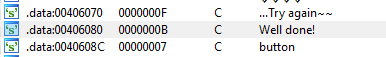
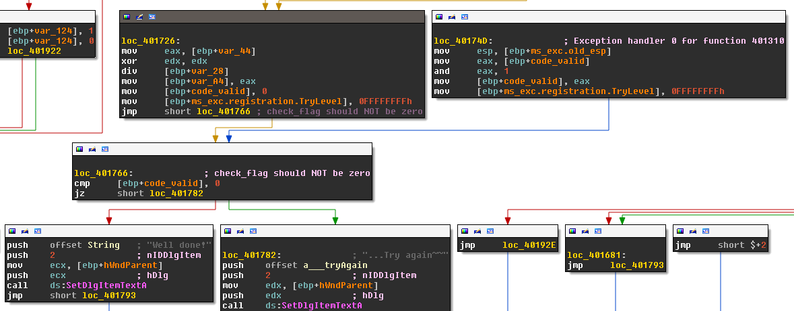

% Solution to zaas's Old_KeygenMe_2010
% baderj (http://www.johannesbader.ch)
% Oct. 23rd 2014

## An Exceptional Path

I used IDA Pro to solve this crackme. First I searched for the good boy message by looking at the strings, see Figure \ref{strings}. There is one reference to the good boy message "Well done!", see Figure \ref{good_and_bad_boy}. 

A simple check of the stack variable ``[ebp-0B0h]``, which I renamed to ``code_valid``, decides whether we failed (``code_valid`` is False), or succeeded (``name_valid`` is True):

    .text:00401766                 cmp     dword ptr [ebp+name_valid], 0 

Two paths lead up to the check. The left path in Figure \ref{good_and_bad_boy} ends with the following lines:

    .text:00401726                 mov     eax, [ebp+var_44]
    .text:00401729                 xor     edx, edx
    .text:0040172B                 div     [ebp+var_28]
    .text:0040172E                 mov     [ebp+var_A4], eax
    .text:00401734                 mov     [ebp+name_valid], 0
    .text:0040173E                 mov     [ebp+ms_exc.registration.TryLevel], 0FFFFFFFFh
    .text:00401745                 jmp     short loc_401766 ; check_flag should NOT be zero

In Line ``.text:00401734`` the variable ``name_valid`` is set to ``False``, so this path can't be it. The right path looks better:

    .text:0040174D loc_40174D:                             ; DATA XREF: .rdata:stru_405118o
    .text:0040174D                 mov     esp, [ebp+ms_exc.old_esp] ; Exception handler 0 for function 401310
    .text:00401750                 mov     eax, [ebp+name_valid]
    .text:00401756                 and     eax, 1
    .text:00401759                 mov     [ebp+name_valid], eax
    .text:0040175F                 mov     [ebp+ms_exc.registration.TryLevel], 0FFFFFFFFh

Line ``.text:00401759`` sets ``name_valid`` to True. The problem with this block is that seemingly no path, i.e., arrows in IDA's graph view, lead to to those lines. That is because it is an "Exception handler 0 for function 401310" as IDA Pro recognized and commented in line ``.text:0040174D``. The exception handler takes care of all exception thrown inside the first level try block inside the routine ``401310``. We find the start of this try block a couple of lines backwards from the good boy check:

    .text:00401686                 mov     [ebp+ms_exc.registration.TryLevel], 0 ; start of try block

The try block ends here:

    .text:0040173E                 mov     [ebp+ms_exc.registration.TryLevel], 0FFFFFFFFh

To get to the good boy message, we need to trigger an exception inside the try block.

## Valid Names
Let's see what happens with the name and code after we hit ``OK``. Going back a few block inside the subroutine ``401310`` we find the characteristic lines that read the values of the two input boxes:: 

    .text:00401639                 push    32h             ; cchMax
    .text:0040163B                 lea     edx, [ebp+name]
    .text:00401641                 push    edx             ; lpString
    .text:00401642                 push    1               ; nIDDlgItem
    .text:00401644                 mov     eax, [ebp+hWndParent]
    .text:00401647                 push    eax             ; hDlg
    .text:00401648                 call    ds:GetDlgItemTextA
    .text:0040164E                 mov     [ebp+name_length], eax ; name_length
    .text:00401654                 push    32h             ; cchMax
    .text:00401656                 lea     ecx, [ebp+code]
    .text:0040165C                 push    ecx             ; lpString
    .text:0040165D                 push    2               ; nIDDlgItem
    .text:0040165F                 mov     edx, [ebp+hWndParent]
    .text:00401662                 push    edx             ; hDlg
    .text:00401663                 call    ds:GetDlgItemTextA
    .text:00401669                 mov     [ebp+code_length], eax ; code_length
    .text:0040166F                 cmp     [ebp+name_length], 0
    .text:00401676                 jz      short loc_401681
    .text:00401678                 cmp     [ebp+code_length], 0

This snippet fetches the content of both input boxes and checks if they contain text. If they do, the code enters the ``try``-block (so any exception thrown from now on gives us the good boy message)::

    .text:00401686 ; ---------------------------------------------------------------------------
    .text:00401686
    .text:00401686 loc_401686:                             ; CODE XREF: sub_401310+36Fj
    .text:00401686                 mov     [ebp+ms_exc.registration.TryLevel], 0 ; start of try block
    .text:0040168D                 cmp     [ebp+name_length], 4
    .text:00401694                 jb      short loc_40169F
    .text:00401696                 cmp     [ebp+code_length], 4
    .text:0040169D                 jnb     short loc_4016B1
    .text:0040169F
    .text:0040169F loc_40169F:                             ; CODE XREF: sub_401310+384j
    .text:0040169F                 xor     eax, eax
    .text:004016A1                 cmp     [ebp+name_valid], 0
    .text:004016A8                 setz    al
    .text:004016AB                 mov     [ebp+name_valid], eax ; check_flag = 0
    .text:004016B1
    .text:004016B1 loc_4016B1:                             ; CODE XREF: sub_401310+38Dj
    .text:004016B1                 mov     [ebp+i], 0
    .text:004016BB                 jmp     short loc_4016CC
    .text:004016BD ; ---------------------------------------------------------------------------

The code checks if the length of the ``name`` field is at least 4 characters. If not, it sets the variable ``[ebp+name_valid]`` to ``False``. Otherwise, the variable stays at ``True`` as set in line ``40162F``::

    .text:0040162F                 mov     [ebp+name_valid], 1

If the name has at least four characters we enter a loop::

    .text:004016B1 loc_4016B1:                             ; CODE XREF: sub_401310+38Dj
    .text:004016B1                 mov     [ebp+i], 0
    .text:004016BB                 jmp     short loc_4016CC
    .text:004016BD ; ---------------------------------------------------------------------------
    .text:004016BD
    .text:004016BD loc_4016BD:                             ; CODE XREF: sub_401310+3EEj
    .text:004016BD                 mov     ecx, [ebp+i]    ; increment
    .text:004016C3                 add     ecx, 1
    .text:004016C6                 mov     [ebp+i], ecx
    .text:004016CC
    .text:004016CC loc_4016CC:                             ; CODE XREF: sub_401310+3ABj
    .text:004016CC                 mov     edx, [ebp+i]
    .text:004016D2                 cmp     edx, [ebp+name_length]
    .text:004016D8                 jnb     short loc_401700
    .text:004016DA                 mov     eax, [ebp+i]
    .text:004016E0                 mov     cl, [ebp+eax+name] ; name[i]
    .text:004016E7                 push    ecx
    .text:004016E8                 call    sub_4019A0
    .text:004016ED                 add     esp, 4
    .text:004016F0                 mov     edx, [ebp+name_valid]
    .text:004016F6                 and     edx, eax
    .text:004016F8                 mov     [ebp+name_valid], edx ; if not sub_4019A0(c): check_flag = False
    .text:004016FE                 jmp     short loc_4016BD ; increment

This code snippet iterates over all characters in ``name``. It calls a routine ``sub_4019A0`` for all characters in ``name``, and updates the ``name_valid`` flag based on the return value of ``sub_4019A0``:

    name_valid = name_valid && sub_4019A0(name[i])

So ``sub_4019A0`` is most likely a check for valid characters. If one of the characters in name is invalid, the flag ``name_valid`` becomes False (and stays False). The routine ``sub_4019A0`` is::

    .text:004019A0 sub_4019A0      proc near               ; CODE XREF: sub_401310+3D8p
    .text:004019A0
    .text:004019A0 character       = byte ptr  4
    .text:004019A0
    .text:004019A0 c = al
    .text:004019A0                 mov     c, [esp+character]
    .text:004019A4                 cmp     c, '/'
    .text:004019A6                 jle     short no_numbers ; jump if below numbers
    .text:004019A8                 cmp     c, ':'
    .text:004019AA                 jl      short loc_4019BC ; jump if number
    .text:004019AC
    .text:004019AC no_numbers:                             ; CODE XREF: sub_4019A0+6j
    .text:004019AC                 cmp     c, 'A'
    .text:004019AE                 jl      short loc_4019B4 ; jump if not letter
    .text:004019B0                 cmp     c, 'Z'
    .text:004019B2                 jle     short loc_4019BC ; jump if capital letter
    .text:004019B4
    .text:004019B4 loc_4019B4:                             ; CODE XREF: sub_4019A0+Ej
    .text:004019B4                 cmp     c, 'a'
    .text:004019B6                 jl      short loc_4019C2 ; jump if special
    .text:004019B8                 cmp     c, 'z'
    .text:004019BA                 jg      short loc_4019C2 ; jump if lower case letter
    .text:004019BC
    .text:004019BC loc_4019BC:                             ; CODE XREF: sub_4019A0+Aj
    .text:004019BC                                         ; sub_4019A0+12j
    .text:004019BC                 mov     eax, 1          ; return True
    .text:004019C1                 retn
    .text:004019C2 ; ---------------------------------------------------------------------------
    .text:004019C2
    .text:004019C2 loc_4019C2:                             ; CODE XREF: sub_4019A0+16j
    .text:004019C2                                         ; sub_4019A0+1Aj
    .text:004019C2                 xor     eax, eax        ; return False
    .text:004019C4                 retn
    .text:004019C4 sub_4019A0      endp

The routine checks if the character is one of the following:

- a digit
- an uppercase letter
- a lowercase letter

In other words, this is the C function [``isalnum``](http://www.cplusplus.com/reference/cctype/isalnum/). After checking all characters in name we get to:: 

    .text:00401700                 cmp     [ebp+name_valid], 0
    .text:00401707                 jz      short loc_401726 ; if name invalid -> failed

If the name has at least four characters, and all characters of the name are alpha numeric, then the flag ``name_valid`` is still True and we continue, otherwise we jump to ``loc_401726`` and the bad boy message is shown.

## The Key Validation 
If the name is valid, the following lines are executed::

    .text:00401709                 lea     eax, [ebp+code]
    .text:0040170F                 push    eax
    .text:00401710                 lea     ecx, [ebp+name]
    .text:00401716                 push    ecx
    .text:00401717                 lea     edx, [ebp+var_28]
    .text:0040171A                 push    edx
    .text:0040171B                 call    sub_401960      ; ecx = code
    .text:00401720                 add     esp, 0Ch
    .text:00401723                 mov     [ebp+var_44], eax

They boil down to:

    var_44 = sub_401960(var_28, name, code)

The routine sub_401960 calculates a value based on the ``name`` and ``code``. The first argument of the function ``var_28`` was initialized to 0 before and will probably hold a second return value of ``sub_401960`` (besides the one in ``<eax>``):

    .text:00401353                 mov     [ebp+var_28], 0

So let's have a look at ``sub_401960``::

    .text:00401960 sub_401960      proc near               ; CODE XREF: sub_401310+40Bp
    .text:00401960
    .text:00401960 result          = dword ptr  4
    .text:00401960 name            = dword ptr  8
    .text:00401960 code            = dword ptr  0Ch
    .text:00401960
    .text:00401960                 mov     ecx, [esp+code]
    .text:00401964                 mov     edx, [esp+result] ; starts at 0
    .text:00401968                 push    ebx
    .text:00401969                 push    ebp
    .text:0040196A                 push    esi
    .text:0040196B                 mov     esi, [esp+0Ch+name] ; esi = name
    .text:0040196F                 push    edi
    .text:00401970                 xor     eax, eax        ; sum=0
    .text:00401972                 sub     esi, ecx
    .text:00401974                 mov     edi, 4          ; repeat four times
    .text:00401979
    .text:00401979 loc_401979:                             ; CODE XREF: sub_401960+2Cj
    .text:00401979                 movsx   ebx, byte ptr [esi+ecx] ; name[i]
    .text:0040197D                 mov     ebp, [edx]      ; result
    .text:0040197F                 add     eax, ebx        ; sum = sum + name[i]
    .text:00401981                 movsx   ebx, byte ptr [ecx] ; code[i]
    .text:00401984                 add     ebx, eax        ; ebx = sum + code[i]
    .text:00401986                 add     ebp, ebx        ; result = result + ebx
    .text:00401988                 inc     ecx
    .text:00401989                 dec     edi
    .text:0040198A                 mov     [edx], ebp
    .text:0040198C                 jnz     short loc_401979 ; name[i]
    .text:0040198E                 mov     ecx, added_to_weighted_sum
    .text:00401994                 mov     esi, ebp
    .text:00401996                 add     esi, ecx        ; add constant
    .text:00401998                 pop     edi
    .text:00401999                 mov     [edx], esi
    .text:0040199B                 pop     esi
    .text:0040199C                 pop     ebp
    .text:0040199D                 pop     ebx
    .text:0040199E                 retn
    .text:0040199E sub_401960      endp

The code boils down to the following pseudocode:

    FUNCTION sub_401960(int* result, char* name, char* code)
        rv = 0
        FOR i = 0 TO 3
            rv += name[i]
            result += sum + code[i]
        END FOR
        result += added_to_weighted_sum
        RETURN rv
    END

Let $n_i$, $c_i$ be the *i*th character of the name and code respectively, and let $C$ be the constant ``added_to_weighted_sum``, then the above code calculates:

$$
\begin{aligned}
result &= \left(\sum_{i=0}^3 c_i \right) 4 n_3 + 3 n_2 + 2 n_1 + n_0 + C \\
rv &= \sum_{i=0}^3 n_i 
\end{aligned}
$$

The return value of ``sub_401960`` is stored in ``[ebp+rv]``. 

    .text:0040171B                 call    sub_401960      ; ecx = code
    .text:00401720                 add     esp, 0Ch
    .text:00401723                 mov     [ebp+rv], eax

Next follow the last lines of our try block:: 

    .text:00401726 loc_401726:                             ; CODE XREF: sub_401310+3F7j
    .text:00401726                 mov     eax, [ebp+rv]
    .text:00401729                 xor     edx, edx
    .text:0040172B                 div     [ebp+var_28]
    .text:0040172E                 mov     [ebp+var_A4], eax
    .text:00401734                 mov     [ebp+code_valid], 0
    .text:0040173E                 mov     [ebp+ms_exc.registration.TryLevel], 0FFFFFFFFh

Finally we've got an instruction that can throw an exception (the division by zero exception):

    .text:0040172B                 div     [ebp+var_28]

The ``div`` statement divides what is in ``edx:eax`` by ``var_28``. ``edx`` is set to zero, and ``eax`` holds the return value of ``sub_401960``. We don't care about these values, because a division by zero exception only occurs when the divisor is zero, regardless of the dividend. The divisor ``var_28`` was the first argument passed to ``sub_401960``, i.e., the ``result`` of the routine ``sub_401960``. **If a name/code pair leads to ``result`` being 0, an exception is thrown and we solved the crackme**. With the mathematical notation introduced before this means:

$$
result = \left(\sum_{i=0}^3 c_i \right) + 4 n_3 + 3 n_2 + 2 n_1 + n_0 + C \stackrel{!}{=} 0
$$

What is the value of $C$? If you check the value of ``added_to_weighted_sum`` with a debugger it is 0 as set in this line::

    .data:00408570 added_to_weighted_sum dd 0              ; DATA XREF: .text:0040112Ar

So how can we get the variable ``result`` to become zero? The values of $n_0$ to $n_3$ are alpha numeric ASCII codes and therefore greater than 0. The values of $c_i$ are the ASCII codes of the code and also positive. So with $C$ being zero there is no way to get the sum in ``result`` to zero. We need to find a way to change $C$ aka ``added_to_weighted_sum``.

## A Secret Key Combination
To see how we can change ``added_to_weighted_sum`` let's check the references to this variable. Outside of ``sub_401960`` the only other references are inside the following code snippet:

    .text:00401102                 cmp     pressed_shift_3_before, 0
    .text:00401109                 jnz     short loc_40113C
    .text:0040110B                 cmp     dword ptr [ebp+pressed_key], '3' ; 3 pressed
    .text:0040110F                 jnz     short loc_40113C
    .text:00401111                 push    10h
    .text:00401113                 call    ds:GetKeyState
    .text:00401119                 movsx   eax, ax
    .text:0040111C                 test    eax, eax
    .text:0040111E                 jge     short loc_40113C
    .text:00401120                 mov     pressed_shift_3_before, 1
    .text:0040112A                 mov     ecx, added_to_weighted_sum
    .text:00401130                 sub     ecx, 586h
    .text:00401136                 mov     added_to_weighted_sum, ecx

The whole snippet is inside the callback that registers key presses. I renamed some variables to make clearer what the snippet does. It boils down to this:

    IF NOT pressed_shift_3_before THEN
        IF pressed_key == '3' THEN 
            key_state = GetKeyState()
            IF key_state != 0 THEN
                pressed_shift_3_before = True
                added_to_weighted_sum = -0x586
            END IF
        END IF
    END IF

This means that the first time we press key ``3`` together with ``Shift`` (which will give a non zero ``KeyState``), the value ``added_to_weighted_sum`` is set to -586h. On an US keyboard layout this means our code needs to contain the ``#`` character. We can enter this character at any point before hitting ``OK``, we can also enter it more than once. As long as there is the letter ``#`` somewhere in our code, the constant ``added_to_weighted_sum``, i.e., $C$, becomes 0x586h.

## The Keygenerator
We know two things about our code now. First of, it needs to contain ``Shift+3`` (the hash character on US keyboards, the star ``*`` on Swiss keyboards and the ``§`` on German keyboards). Secondly, the following equation must hold:

$$
\left(\sum_{i=0}^3 c_i\right) + 4 n_3 + 3 n_2 + 2 n_1 + n_0 + C \stackrel{!}{=} 0
$$

So with $C = -586h$ we have:

$$
\left(\sum_{i=0}^3 c_i\right) \stackrel{!}{=} 586h - 4 n_3 - 3 n_2 - 2 n_1 - n_0 
$$

This condition can be met by many different codes for each name. Here is a simple keygenerator that picks four characters that satisfy the sum, then adds the ``#`` character to trigger the code to set the ``added_to_weighted_sum`` alias $C$ value::

    import string
    import argparse

    def keygen(name):
        code_sum = 0x586
        for i in range(4):
            code_sum -= (4-i)*ord(name[i])

        nice_ascii = string.ascii_letters + string.digits
        nice_ascii_nr = [ord(c) for c in nice_ascii]
        code_list = 4*[0]
        for i in  range(3):
            avg = (code_sum - sum(code_list)) // (4-i)
            code_list[i] = min(nice_ascii_nr, key=lambda x: abs(x-avg))
        code_list[3] = code_sum - sum(code_list)
        code = "".join([chr(c) for c in code_list] )
        return code

    parser = argparse.ArgumentParser("Keygen for Old_KeygenMe.exe")
    parser.add_argument("name")
    args = parser.parse_args()
    if len(args.name) < 4:
        print("Name must have at least 4 characters")
        quit()
    code = keygen(args.name)
    print("enter the following code: {}".format(code))
    print("next enter SHIFT+3 and hit OK")
    print("-> so on US keyboards enter: {}".format(code+"#"))

Here's a test::

    > keygen.py sheldon
    enter the following code: SSSS
    next enter SHIFT+3 and hit OK
    -> so on US keyboards enter: SSSS#
