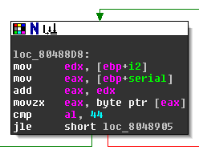
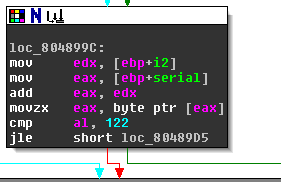

# Solution to crackme05 by seVeb 
author: baderj (www.johannesbader.ch)

Crackme Infos:

- name: crackme05 
- author: seVeb 
- published: 2014-09-09
- difficulty: 1 - Very easy, for newbies
- plattform: Unix/linux etc. 
- language: C/C++
- link: http://www.crackmes.de/users/seveb/crackme05/
- description: Welcome to crackme05 reverser!
Your task is simple, figure out a way to generate valid serials.
Patching is as expected not allowed. Write a keygen and tell us
how you solved the crackme. 
  Invoke the crackme with the --help or -h flag for additional help.

## Intro
The first few lines of the crackme check if there`s at least one argument. If arguments are missing, the usage statement is shown with a call to ``usage``:

    .text:0804852D                 public main
    .text:0804852D main            proc near               ; DATA XREF: _start+17o
    .text:0804852D
    .text:0804852D var_10C         = dword ptr -10Ch
    .text:0804852D var_108         = dword ptr -108h
    .text:0804852D args            = dword ptr -100h
    .text:0804852D var_F8          = dword ptr -0F8h
    .text:0804852D var_F3          = dword ptr -0F3h
    .text:0804852D var_82          = dword ptr -82h
    .text:0804852D var_10          = dword ptr -10h
    .text:0804852D var_C           = dword ptr -0Ch
    .text:0804852D argc            = dword ptr  8
    .text:0804852D argv            = dword ptr  0Ch
    .text:0804852D
    .text:0804852D                 push    ebp
    .text:0804852E                 mov     ebp, esp
    .text:08048530                 push    edi
    .text:08048531                 push    esi
    .text:08048532                 push    ebx
    .text:08048533                 and     esp, 0FFFFFFF0h
    .text:08048536                 sub     esp, 100h       ; char *
    .text:0804853C                 mov     eax, [ebp+argv]
    .text:0804853F                 mov     [esp+10Ch+args], eax
    .text:08048543                 mov     eax, large gs:14h
    .text:08048549                 mov     [esp+10Ch+var_10], eax
    .text:08048550                 xor     eax, eax
    .text:08048552                 cmp     [ebp+argc], 1
    .text:08048556                 jg      short loc_8048570
    .text:08048558                 mov     eax, [esp+10Ch+args]
    .text:0804855C                 mov     eax, [eax]
    .text:0804855E                 mov     [esp+10Ch+var_10C], eax
    .text:08048561                 call    usage
    .text:08048566                 mov     eax, 1
    .text:0804856B                 jmp     loc_8048732
    .text:08048570 ; ---------------------------------------------------------------------------
    .text:08048570
    .text:08048570 loc_8048570:                            ; CODE XREF: main+29j
    .text:08048570                 mov     [esp+10Ch+var_F8], 0
    .text:08048578                 jmp     short loc_80485E5

Next the code checks if the first argument is either ``-h`` or ``--help``. If it isn`, we end up here::

    .text:08048600                 mov     eax, [esp+10Ch+args]
    .text:08048604                 add     eax, 4
    .text:08048607                 mov     eax, [eax]
    .text:08048609                 mov     [esp+10Ch+var_10C], eax
    .text:0804860C                 call    rock

The code gets the value ``argv[1]`` (the first commandline argument, i.e., the serial) and puts it on top of the stack (``[esp+10Ch+var_10C]`` is in fact ``[esp]``). The serial is the only argument to the ``rock`` subroutine called next.

## Rock
The graph view of ``rock``, with most of the blocks grouped, looks as shown in Figure \ref{loop}:

From this picture you can clearly see a loop (backward pointing, bold blue arrow). The local variables at ``ebp-10h`` and ``ebp-0Ch`` serve as redundant loop counters, I renamed them two ``i`` and ``i2`` respectively. The loop iterates over all characters in ``serial``, i.e., until the terminating zero byte is reached. The length of the serial, as the loop counter ``i``, is compared to 19. If the serial length is not 19, the bad boy message is shown with ``call bomb``:

    ROCK 4: Serial not 19 chars!

             ,--.!, 
          __/   -*- 
        ,d08b.  '|` 
        0088MM      
        `9MMP'      
    I have not failed. I've just found 10,000 ways that won't work.
    - Thomas Edison

The content inside the loop is assessed mos readily with the graph view of IDA. At the bottom of the subroutine we see 3 bad boy nodes, see Figure \ref{bombs}.  We clearly need to find a path that avoids those nodes. 

### First Hurdle
The content of the loop (see Figure \ref{hurdle1}) starts with the following node. If the jump is taken, we get to one of the bomb message. The register ``edx`` holds the loop counter ``i``, and ``eax`` points to the ``serial``. By adding the two registers and dereferencing the result we get ``al = serial[i]``. In the following I`m using ``c=serial[i]`` to refer to the current serial character. The jump is *not* taken if ``c > 44``. 

### Second Hurdle
We enter the second stage (Figure \ref{l2}) if ``c > 44``. The bomb message is shown if both jumps are *not* taken. So either ``c <= 45`` (we take the first jump), or ``c > 45 && c > 47`` (we take the second jump). So after the second hurdle we have ``c == 45 || c > 47``. 

### Third Hurdle
We enter the next stage (see Figure \ref{l3}) with ``c == 45 || c > 47``.  Again the bomb goes off if both jumps are *not* taken. This can be avoided with ``c <= 57`` or ``c > 57 && c > 64``. Together with what we already know this gives us ``c = 45 || 47 < c <= 57 || c > 64``

### Fourth Hurdle
The next stage, shown in Figure \ref{l4},  is reached with ``c = 45 || 47 < c <= 57 || c > 64``.  The bomb detonates when the jump in the second node is take. So either the jump in the first node is taken with ``c <= 90`` or the jump in the second node is *not* taken with ``c > 96 && c > 96``. We end up with ``c = 45 || 47 < c <= 57 || 64 < c <= 90 || c > 96``

### Fifth (and Last) Hurdle
The final hurdle is shown in Figure \ref{l5}.

The bomb does not go off if the jump is taken, therefore ``c <= 122``. So all in all we have::

    c = 45 || 47 < c <= 57 || 64 < c <= 90 || 96 < c <= 122

Or by using the corresponding ASCII characters:

    c = '-' || '0' <= c <= '9' || 'a' <= c <= 'z' || 'A' <= c <= 'Z' 

**If our serial is exactly 19 characters from the following set, the bomb won`t detonate (just yet)**

- -
- 0123456789
- abcdefghijklmnopqrstuvwxyz
- ABCDEFGHIJKLMNOPQRSTUVXWYZ

## Paper
After ``rock`` follows a call to ``paper``, again ``serial`` is the only argument:

    .text:08048A09 ; ||||||||||||||| S U B R O U T I N E |||||||||||||||||||||||||||||||||||||||
    .text:08048A09
    .text:08048A09 ; Attributes: bp-based frame
    .text:08048A09
    .text:08048A09                 public paper
    .text:08048A09 paper           proc near               ; CODE XREF: main
    .text:08048A09
    .text:08048A09 var_28          = dword ptr -28h
    .text:08048A09 var_10          = dword ptr -10h
    .text:08048A09 var_C           = dword ptr -0Ch
    .text:08048A09 serial          = dword ptr  8
    .text:08048A09
    .text:08048A09                 push    ebp
    .text:08048A0A                 mov     ebp, esp
    .text:08048A0C                 sub     esp, 28h        ; char *
    .text:08048A0F                 mov     eax, [ebp+serial]
    .text:08048A12                 add     eax, 8
    .text:08048A15                 movzx   edx, byte ptr [eax]
    .text:08048A18                 mov     eax, [ebp+serial]
    .text:08048A1B                 add     eax, 0Ah
    .text:08048A1E                 movzx   eax, byte ptr [eax]
    .text:08048A21                 xor     eax, edx
    .text:08048A23                 movsx   eax, al
    .text:08048A26                 add     eax, 30h
    .text:08048A29                 mov     [ebp+var_10], eax
    .text:08048A2C                 mov     eax, [ebp+serial]
    .text:08048A2F                 add     eax, 5
    .text:08048A32                 movzx   edx, byte ptr [eax]
    .text:08048A35                 mov     eax, [ebp+serial]
    .text:08048A38                 add     eax, 0Dh
    .text:08048A3B                 movzx   eax, byte ptr [eax]
    .text:08048A3E                 xor     eax, edx
    .text:08048A40                 movsx   eax, al
    .text:08048A43                 add     eax, 30h
    .text:08048A46                 mov     [ebp+var_C], eax
    .text:08048A49                 cmp     [ebp+var_10], 39h
    .text:08048A4D                 jg      short loc_8048A55
    .text:08048A4F                 cmp     [ebp+var_C], 39h
    .text:08048A53                 jle     short loc_8048A68
    .text:08048A55
    .text:08048A55 loc_8048A55:                            ; CODE XREF: paper+44j
    .text:08048A55                 mov     [esp+28h+var_28], offset aPaper1 ; "Paper 1"
    .text:08048A5C                 call    _puts
    .text:08048A61                 call    bomb
    .text:08048A66                 jmp     short loc_8048A85
    .text:08048A68 ; ---------------------------------------------------------------------------
    .text:08048A68
    .text:08048A68 loc_8048A68:                            ; CODE XREF: paper+4Aj
    .text:08048A68                 cmp     [ebp+var_10], 2Fh
    .text:08048A6C                 jle     short loc_8048A74
    .text:08048A6E                 cmp     [ebp+var_C], 2Fh
    .text:08048A72                 jg      short loc_8048A85
    .text:08048A74
    .text:08048A74 loc_8048A74:                            ; CODE XREF: paper+63j
    .text:08048A74                 mov     [esp+28h+var_28], offset aPaper1Lower ; "Paper 1 lower"
    .text:08048A7B                 call    _puts
    .text:08048A80                 call    bomb
    .text:08048A85
    .text:08048A85 loc_8048A85:                            ; CODE XREF: paper+5Dj
    .text:08048A85                                         ; paper+69j
    .text:08048A85                 mov     eax, [ebp+serial]
    .text:08048A88                 add     eax, 3
    .text:08048A8B                 movzx   eax, byte ptr [eax]
    .text:08048A8E                 movsx   eax, al
    .text:08048A91                 cmp     eax, [ebp+var_10]
    .text:08048A94                 jnz     short loc_8048AA7
    .text:08048A96                 mov     eax, [ebp+serial]
    .text:08048A99                 add     eax, 0Fh
    .text:08048A9C                 movzx   eax, byte ptr [eax]
    .text:08048A9F                 movsx   eax, al
    .text:08048AA2                 cmp     eax, [ebp+var_10]
    .text:08048AA5                 jz      short loc_8048ABA
    .text:08048AA7
    .text:08048AA7 loc_8048AA7:                            ; CODE XREF: paper+8Bj
    .text:08048AA7                 mov     [esp+28h+var_28], offset aPaper2 ; "Paper 2"
    .text:08048AAE                 call    _puts
    .text:08048AB3                 call    bomb
    .text:08048AB8                 jmp     short locret_8048AEA
    .text:08048ABA ; ---------------------------------------------------------------------------
    .text:08048ABA
    .text:08048ABA loc_8048ABA:                            ; CODE XREF: paper+9Cj
    .text:08048ABA                 mov     eax, [ebp+serial]
    .text:08048ABD                 movzx   eax, byte ptr [eax]
    .text:08048AC0                 movsx   eax, al
    .text:08048AC3                 cmp     eax, [ebp+var_C]
    .text:08048AC6                 jnz     short loc_8048AD9
    .text:08048AC8                 mov     eax, [ebp+serial]
    .text:08048ACB                 add     eax, 12h
    .text:08048ACE                 movzx   eax, byte ptr [eax]
    .text:08048AD1                 movsx   eax, al
    .text:08048AD4                 cmp     eax, [ebp+var_C]
    .text:08048AD7                 jz      short locret_8048AEA
    .text:08048AD9
    .text:08048AD9 loc_8048AD9:                            ; CODE XREF: paper+BDj
    .text:08048AD9                 mov     [esp+28h+var_28], offset aPaper3 ; "Paper 3"
    .text:08048AE0                 call    _puts
    .text:08048AE5                 call    bomb
    .text:08048AEA
    .text:08048AEA locret_8048AEA:                         ; CODE XREF: paper+AFj
    .text:08048AEA                                         ; paper+CEj
    .text:08048AEA                 leave
    .text:08048AEB                 retn
    .text:08048AEB paper           endp
    .text:08048AEB
    .text:08048AEC

The code decompiles to: 

    void paper(char* serial)
    {
        char t1 = (serial[8] ^ serial[10]) + 48;
        char t2 = (serial[5] ^ serial[13]) + 48;

        if ( t1 > 57 || t2 > 57 )
            // FAIL: "Paper 1"

        if ( v2 <= 47 || v3 <= 47 )
            // FAIL: "Paper 1 lower"

        if ( serial[3] != t1 || serial[15] != t2 )
            // FAIL: "Paper 2"

        if ( serial[0] != t2 || serial[18] != v3) )
            // FAIL: "Paper 3"

        //OK
    }

As long as those four *if*-conditionas are not met, we survive the *paper* stage.

## Scissors
After ``paper`` follows a call to ``scissors``, again ``serial`` is the only argument:

    .text:08048AEC ; ||||||||||||||| S U B R O U T I N E |||||||||||||||||||||||||||||||||||||||
    .text:08048AEC
    .text:08048AEC ; Attributes: bp-based frame
    .text:08048AEC
    .text:08048AEC                 public scissors
    .text:08048AEC scissors        proc near               ; CODE XREF: main+101p
    .text:08048AEC
    .text:08048AEC var_28          = dword ptr -28h
    .text:08048AEC var_10          = dword ptr -10h
    .text:08048AEC var_C           = dword ptr -0Ch
    .text:08048AEC serial          = dword ptr  8
    .text:08048AEC
    .text:08048AEC                 push    ebp
    .text:08048AED                 mov     ebp, esp
    .text:08048AEF                 sub     esp, 28h        ; char *
    .text:08048AF2                 mov     eax, [ebp+serial]
    .text:08048AF5                 add     eax, 1
    .text:08048AF8                 movzx   eax, byte ptr [eax]
    .text:08048AFB                 movsx   edx, al
    .text:08048AFE                 mov     eax, [ebp+serial]
    .text:08048B01                 add     eax, 2
    .text:08048B04                 movzx   eax, byte ptr [eax]
    .text:08048B07                 movsx   eax, al
    .text:08048B0A                 add     eax, edx
    .text:08048B0C                 mov     [ebp+var_10], eax
    .text:08048B0F                 mov     eax, [ebp+serial]
    .text:08048B12                 add     eax, 10h
    .text:08048B15                 movzx   eax, byte ptr [eax]
    .text:08048B18                 movsx   edx, al
    .text:08048B1B                 mov     eax, [ebp+serial]
    .text:08048B1E                 add     eax, 11h
    .text:08048B21                 movzx   eax, byte ptr [eax]
    .text:08048B24                 movsx   eax, al
    .text:08048B27                 add     eax, edx
    .text:08048B29                 mov     [ebp+var_C], eax
    .text:08048B2C                 cmp     [ebp+var_10], 0AAh
    .text:08048B33                 jle     short loc_8048B3E
    .text:08048B35                 cmp     [ebp+var_C], 0AAh
    .text:08048B3C                 jg      short loc_8048B51
    .text:08048B3E
    .text:08048B3E loc_8048B3E:                            ; CODE XREF: scissors+47j
    .text:08048B3E                 mov     [esp+28h+var_28], offset aScissors1 ; "Scissors 1"
    .text:08048B45                 call    _puts
    .text:08048B4A                 call    bomb
    .text:08048B4F                 jmp     short locret_8048B6A
    .text:08048B51 ; ---------------------------------------------------------------------------
    .text:08048B51
    .text:08048B51 loc_8048B51:                            ; CODE XREF: scissors+50j
    .text:08048B51                 mov     eax, [ebp+var_10]
    .text:08048B54                 cmp     eax, [ebp+var_C]
    .text:08048B57                 jnz     short locret_8048B6A
    .text:08048B59                 mov     [esp+28h+var_28], offset aScissors2 ; "Scissors 2"
    .text:08048B60                 call    _puts
    .text:08048B65                 call    bomb
    .text:08048B6A
    .text:08048B6A locret_8048B6A:                         ; CODE XREF: scissors+63j
    .text:08048B6A                                         ; scissors+6Bj
    .text:08048B6A                 leave
    .text:08048B6B                 retn
    .text:08048B6B scissors        endp

The disassembly boils down to this function:

    void scissors(char* serial)
    {
        char t1 = serial[1] + serial[2];
        char t2 = serial[16] + serial[17];
        if ( t1 <= 170 || t2 <= 170 )
            // FAIL: "Scissors 1"

        if ( t1 == t2 )
            // FAIL: "Scissors 2";

        // OK
    }

## Cracker
After ``rock``, ``paper`` and ``scissors`` does not follow ``lizard``, but ``cracker``:

    .text:08048B6C ; ||||||||||||||| S U B R O U T I N E |||||||||||||||||||||||||||||||||||||||
    .text:08048B6C
    .text:08048B6C ; Attributes: bp-based frame
    .text:08048B6C
    .text:08048B6C                 public cracker
    .text:08048B6C cracker         proc near               ; CODE XREF: main+112p
    .text:08048B6C
    .text:08048B6C var_28          = dword ptr -28h
    .text:08048B6C var_C           = dword ptr -0Ch
    .text:08048B6C serial          = dword ptr  8
    .text:08048B6C
    .text:08048B6C                 push    ebp
    .text:08048B6D                 mov     ebp, esp
    .text:08048B6F                 sub     esp, 28h        ; char *
    .text:08048B72                 mov     eax, [ebp+serial]
    .text:08048B75                 add     eax, 4
    .text:08048B78                 movzx   eax, byte ptr [eax]
    .text:08048B7B                 movsx   edx, al
    .text:08048B7E                 mov     eax, [ebp+serial]
    .text:08048B81                 add     eax, 9
    .text:08048B84                 movzx   eax, byte ptr [eax]
    .text:08048B87                 movsx   eax, al
    .text:08048B8A                 add     edx, eax
    .text:08048B8C                 mov     eax, [ebp+serial]
    .text:08048B8F                 add     eax, 0Eh
    .text:08048B92                 movzx   eax, byte ptr [eax]
    .text:08048B95                 movsx   eax, al
    .text:08048B98                 add     eax, edx
    .text:08048B9A                 mov     [ebp+var_C], eax
    .text:08048B9D                 cmp     [ebp+var_C], 87h
    .text:08048BA4                 jz      short loc_8048BB9
    .text:08048BA6                 mov     [esp+28h+var_28], offset aCracker1 ; "cracker 1"
    .text:08048BAD                 call    _puts
    .text:08048BB2                 call    bomb
    .text:08048BB7                 jmp     short locret_8048BEB
    .text:08048BB9 ; ---------------------------------------------------------------------------
    .text:08048BB9
    .text:08048BB9 loc_8048BB9:                            ; CODE XREF: cracker+38j
    .text:08048BB9                 mov     ecx, [ebp+var_C] ; ecx = 135
    .text:08048BBC                 mov     edx, 55555556h   ; eax = 1431655766
    .text:08048BC1                 mov     eax, ecx         ; eax = 135
    .text:08048BC3                 imul    edx              ; edx = 45, eax = 90
    .text:08048BC5                 mov     eax, ecx         ; eax = 135
    .text:08048BC7                 sar     eax, 1Fh         ; eax = 0
    .text:08048BCA                 sub     edx, eax         ; edx = 45
    .text:08048BCC                 mov     eax, edx         ; eax = 45
    .text:08048BCE                 add     eax, eax         ; eax = 90
    .text:08048BD0                 add     eax, edx         ; eax = 135
    .text:08048BD2                 sub     ecx, eax         ; ecx = 0
    .text:08048BD4                 mov     edx, ecx         ; edx = 0
    .text:08048BD6                 test    edx, edx         ; zf=1
    .text:08048BD8                 jz      short locret_8048BEB ; jump always taken
    .text:08048BDA                 mov     [esp+28h+var_28], offset aCracker1 ; "cracker 1"
    .text:08048BE1                 call    _puts
    .text:08048BE6                 call    bomb
    .text:08048BEB
    .text:08048BEB locret_8048BEB:                         ; CODE XREF: cracker+4Bj
    .text:08048BEB                                         ; cracker+6Cj
    .text:08048BEB                 leave
    .text:08048BEC                 retn
    .text:08048BEC cracker         endp

The snippet has one strange part starting at offset ``loc_8048BB9``. I added comments on every line to show that the whole sequence does nothing, no matter what the serial is, this sequence will always  jump over the bomb message in line ``08048BE6``. We only need to worry about the code before, which decompiles to:

    void cracker(char* serial)
    {
        if ( serial[9] + serial[4] + serial[14] != 135)
            // FAIL: "cracker 1";

        // OK
    }

Since the smallest ASCII code of the allowed characters is 45 (for the dash ``-``), the condition boils down to:

    void cracker(char* serial)
    {
        if ( serial[9] != 45 || serial[4] != 45 || serial[14] != 45)
            // FAIL: "cracker 1";

        // OK
    }

## Decraycray
If all four stages, ``rock``, ``paper``, ``scissors`` and ``crackers`` are passed without detonating the bomb, you get to those lines::

    .text:08048644                 lea     eax, [esp+10Ch+var_82]
    .text:0804864B                 mov     edx, offset aPassedSerialIs ; "Passed serial is invalid! Just flip you"...

Why is the code loading a ``Passed serial is invalid...`` message even though the bombs did not go off? Next follow a lot of lines that I won`t discuss in detail. All they do is generate a second string. The code sequence leads to a call to ``decraycray``, which take the ``Passed serial`` as one argument, and the generated string as the second argument:

    .text:08048776 ; ||||||||||||||| S U B R O U T I N E |||||||||||||||||||||||||||||||||||||||
    .text:08048776
    .text:08048776 ; Attributes: bp-based frame
    .text:08048776
    .text:08048776                 public decraycray
    .text:08048776 decraycray      proc near               ; CODE XREF: main+1FBp
    .text:08048776                                         ; bomb+E5p
    .text:08048776
    .text:08048776 var_28          = dword ptr -28h
    .text:08048776 var_C           = dword ptr -0Ch
    .text:08048776 crypto          = dword ptr  8
    .text:08048776 key             = dword ptr  0Ch
    .text:08048776
    .text:08048776                 push    ebp
    .text:08048777                 mov     ebp, esp
    .text:08048779                 sub     esp, 28h        ; int
    .text:0804877C                 mov     [ebp+var_C], 0
    .text:08048783                 jmp     short loc_80487AC
    .text:08048785 ; ---------------------------------------------------------------------------
    .text:08048785
    .text:08048785 loc_8048785:                            ; CODE XREF: decraycray+43j
    .text:08048785                 mov     edx, [ebp+var_C]
    .text:08048788                 mov     eax, [ebp+key]
    .text:0804878B                 add     eax, edx
    .text:0804878D                 movzx   edx, byte ptr [eax]
    .text:08048790                 mov     ecx, [ebp+var_C]
    .text:08048793                 mov     eax, [ebp+crypto]
    .text:08048796                 add     eax, ecx
    .text:08048798                 movzx   eax, byte ptr [eax]
    .text:0804879B                 xor     eax, edx
    .text:0804879D                 movsx   eax, al
    .text:080487A0                 mov     [esp+28h+var_28], eax
    .text:080487A3                 call    _putchar
    .text:080487A8                 add     [ebp+var_C], 1
    .text:080487AC
    .text:080487AC loc_80487AC:                            ; CODE XREF: decraycray+Dj
    .text:080487AC                 mov     edx, [ebp+var_C]
    .text:080487AF                 mov     eax, [ebp+crypto]
    .text:080487B2                 add     eax, edx
    .text:080487B4                 movzx   eax, byte ptr [eax]
    .text:080487B7                 test    al, al
    .text:080487B9                 jnz     short loc_8048785
    .text:080487BB                 mov     [esp+28h+var_28], 0Ah
    .text:080487C2                 call    _putchar
    .text:080487C7                 leave
    .text:080487C8                 retn
    .text:080487C8 decraycray      endp

All this snippet does is iterate over all characters in the first argument, and XOR the characters with the corresponding character from the second argument::

    void decraycray(char* crypto, char* key)
    { 
        for ( int i = 0; crypto[i]; i++ )
            printf("%c", crypto[i] ^ key[i];
    }

The subroutine implements an **XOR cipher**. The key length is at least as long as the ciphertext. The decryption can therefore turn the ``Passed serial is invalid...`` ciphertext into any other message by choosing an appropriate key. Since there are no more bombs to defuse in this crackme, we can take an educated guess that the XOR decryption will turn the ``Passed serial is invalid...`` into the good boy message.

## Keygen
Writing a keygen is trivial. One only needs to enforce the four check ``rock``, ``paper``, ``scissors`` and ``cracker``. My keygen first generates a random serial by picking 19 characters from the allowed character set. I then try to fix this serial by setting individual characters. For example, since ``paper`` dictates that:

    48 <= (serial[8] ^ serial[10]) + 48 <= 57

I set ``serial[8]`` to one of the characters that XORed with ``serial[10]`` meets this condition. Only about 6.2% of the time fixing the serial does not work because at some point a condition can`t be fixed. The keygen in Python 2.7 just retries with a different starting point in those cases:

    import string
    import random

    class NoChoices(Exception):
        pass

    def random_serial():
        def random_crit(crit, valid_chars):
            candidates = filter(crit, valid_chars)
            if len(candidates) == 0:
                raise NoChoices("Can't satisfy {}".format(repr(crit)))
            return random.choice(candidates)

        ## Rock
        lowercase = string.ascii_lowercase
        uppercase = string.ascii_uppercase
        digits = string.digits
        minus = '-'
        valid_chars = [ord(o) for o in lowercase + uppercase + digits + minus]
        serial = [random.choice(valid_chars) for i in range(19)]

        ## Paper
        serial[8] = random_crit(lambda x: (x^serial[10]) <= 9, valid_chars)
        serial[5] = random_crit(lambda x: (x^serial[13]) <= 9, valid_chars)
        t1 = (serial[8] ^ serial[10]) + 48
        serial[3] = t1
        serial[15] = t1 
        t2 = (serial[5] ^ serial[13]) + 48
        serial[0] = t2 
        serial[18] = t2 

        ## Scissors
        serial[1] = random_crit(lambda x: x + serial[2] > 170, valid_chars)
        serial[16] = random_crit(lambda x: x + serial[17] > 170 and 
                serial[1] + serial[2] != x + serial[17],
                valid_chars)

        ## Cracker
        serial[4], serial[9], serial[14] = 45,45,45 

        return "".join([chr(c) for c in serial])

    def create_serial():
        while True:
            try:
                return random_serial()
            except NoChoices:
                # 6.2 % chance of failure
                pass

    print(create_serial())

For example:

    $ python keygen.py 
    0st4-vGDj-n1Nv-4vW0

    $ python keygen.py | xargs ./crackme05_64bit 
    In order to succeed you must fail, so that you know what not to do the next time.
    -Anthony J. D'Angelo

    Good Job!

