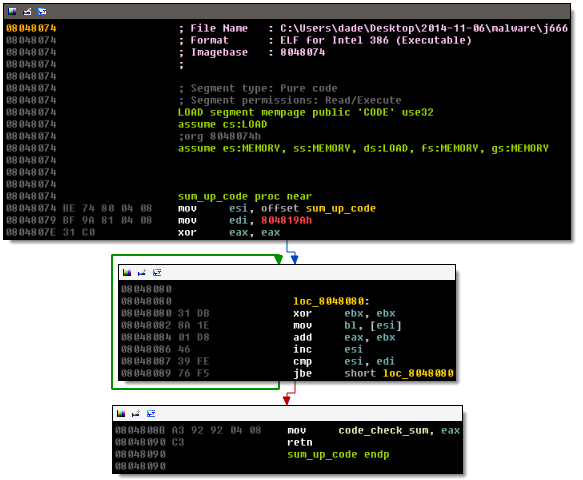
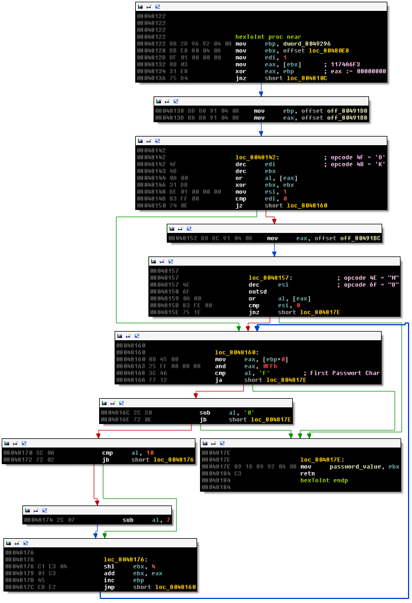
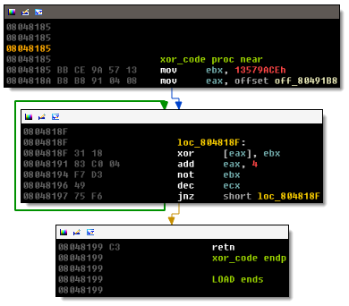

% Solution to josamont's j666 
% baderj (http://www.johannesbader.ch)
% Dec. 8th 2014

This crackme was published December 2nd, 2014. It is rated "3 - Getting harder". The description reads:

> Find the pass

Figure \ref{main} show the main routine. The crackme starts by calling ``sum_up_code``, shown in Figure \ref{sum_up_code}. This code sums up opcode dwords starting from the beginning of the subroutine, until an opcode dword is less than 804819Ah. The result is stored in ``code_check_sum``. By doing this, the crackme can check for the presence of software breakpoints, which change the code by adding ``INT 3``. I don't plan on using a debugger, so I ignore this subroutine.

Next the password is read by a call to ``sys_read``. The value is then converted from hex to binary using the subroutine ``hexToInt`` shown in Figure \ref{hexToInt}. This subroutine starts with an anti patching check: the offset ``80480E8`` is compared to ``F3 A6 74 11`` - this is the location and opcode for:

    F3 A6     repe cmpsb
    74 11     jz   short loc_80480FD

If you want to patch this check, you also need to patch the check in ``hexToInt``. Since I don't plan on patching the crackme, I can ignore this check. The rest of the routine is interpreting the password as hex and converting the value to binary, storing the result in ``password_value``. There are two interesting code sequences in ``hexToInt``:

    4F    dec edi
    4B    dec ebx
    0A 00 or al, [eax] 

and

    4E    dec esi
    6F    outsd
    0A 00 or al, [eax] 

The offset of these code snippets is used as the goodboy and badboy message, ``4F 4B 00`` and ``4E 6F 00`` decode to the null-terminated strings "OK" and "No" respectively.

After ``hexToInt`` there is a call to ``xor_code``, see Figure \ref{xorcode}. The snippet changes 9*4 bytes starting at offset ``80491B8``. The routine affects neither our entered ``password``, nor the hidden password. I don't know what the purpose of this routine is.

\newpage

Finally, we get to the password check:

    LOAD:080480D9                 mov     ecx, 4
    LOAD:080480DE                 mov     esi, offset loc_8048096
    LOAD:080480E3                 mov     edi, offset password_value
    LOAD:080480E8
    LOAD:080480E8 loc_80480E8:                            ; DATA XREF: hexToInt+6o
    LOAD:080480E8                 repe cmpsb
    LOAD:080480EA                 jz      short loc_80480FD
    LOAD:080480EC                 mov     ecx, offset loc_8048157
    LOAD:080480F1                 mov     edx, 4
    LOAD:080480F6                 call    sys_write
    LOAD:080480FB                 jmp     short loc_804810C
    LOAD:080480FD ; ---------------------------------------------------------------------------
    LOAD:080480FD
    LOAD:080480FD loc_80480FD:                            ; CODE XREF: start+59j
    LOAD:080480FD                 mov     ecx, offset loc_8048142
    LOAD:08048102                 mov     edx, 4
    LOAD:08048107                 call    sys_write
    LOAD:0804810C
    LOAD:0804810C loc_804810C:                            ; CODE XREF: start+6Aj
    LOAD:0804810C                                         ; hexToInt+14j
    LOAD:0804810C                 mov     eax, 1
    LOAD:08048111                 xor     ebx, ebx        ; status
    LOAD:08048113                 int     80h             ; LINUX - sys_exit
    LOAD:08048113 start           endp

The check compares four bytes at offset ``8048096`` to the password that we entered, if they match, we get the "OK" string , otherwise the "No" message (both are hidden in ``hexToInt``, see Figure \ref{hexToInt}). At offset ``8048096`` we find:

    LOAD:08048096                   loc_8048096:                            ; DATA XREF: start+4Do
    LOAD:08048096 B9 9A 91 04 08                    mov     ecx, offset aCrackme666Jose ; "Crackme 666 Josep\n"

So the entered password needs to match ``B9 9A 91 04`` because it's little endian we to enter the reverse:

    04919AB9

This gives you the OK message:

    $ ./j666
    Crackme 666 Josep
    Password: 04919AB9
    OK

You can also leave the leading zero.
