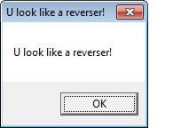
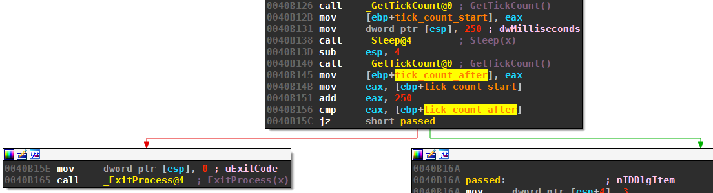
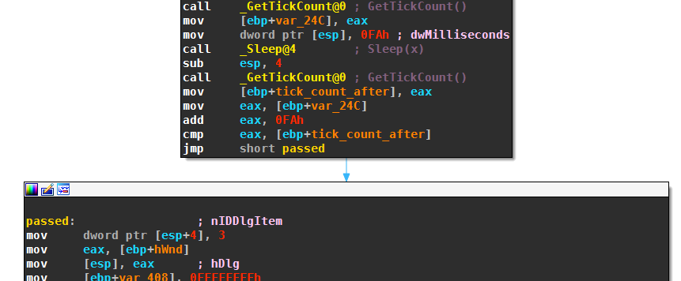
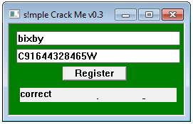

The crackme [s!mple Crack Me v0.3](http://crackmes.de/users/simple_re/smple_crack_me_v0.3/) by simple_re has been published February 14, 2013.
It is rated at *3 - Getting harder*. The crackme is written in C/C++ and runs on Windows.
The description reads:

> Hey reversers, welcome to my third crack me.
>
> Rules: Patching/Serial Phish/Keygen
>
> Goal is to get to correct input, thanks for reversing!
    
## Anti-Debugging
The crackme has a couple of anti-debugging checks that need addressing first.

### Trick 1: IsDebuggerPresent 
The first anti-debugging check is in subroutine *AntiRevIDP(void)*, at offset  00409B8E. The routine dynamically loads the *kernel32.dll*:

    .text:00409BCD mov     dword ptr [esp+8], 0 ; dwFlags
    .text:00409BD5 mov     dword ptr [esp+4], 0 ; hFile
    .text:00409BDD mov     dword ptr [esp], offset LibFileName ; "kernel32.dll"
    .text:00409BE4 mov     [ebp+var_70], 0FFFFFFFFh
    .text:00409BEB call    _LoadLibraryExA@12 ; LoadLibraryExA(x,x,x)

Next, the subroutine calls *IDB(void)*. This nasty routine builds the String *IsDebuggerPresent* by sampling characters from the hardcoded string:

    .rdata:00453000 unicode 0, <simplecortn!BUTONRgIDbuPC SakvQyf>

The *AntiRevIDP(void)* then loads the procedure *IsDebuggerPresent*:

    .text:00409C20 mov     [ebp+lpProcName], eax
    .text:00409C23 mov     eax, [ebp+lpProcName]
    .text:00409C26 mov     [esp+4], eax    ; lpProcName
    .text:00409C2A mov     eax, [ebp+hModule]
    .text:00409C2D mov     [esp], eax      ; hModule
    .text:00409C30 call    _GetProcAddress@8 ; GetProcAddress(x,x)
    .text:00409C30 call    _GetProcAddress@8               ; GetProcAddress(x,x)
    .text:00409C35 sub     esp, 8
    .text:00409C38 mov     [ebp+IsDebuggerPresent], eax

Immediately after that, the routine then calls *IsDebuggerPresent* and sets a flag if a debugger is detected:

    .text:00409C41 mov     eax, [ebp+IsDebuggerPresent]
    .text:00409C44 call    eax
    .text:00409C46 test    eax, eax
    .text:00409C48 jz      short loc_409C51
    .text:00409C4A mov     [ebp+there_is_a_debugger], 1

Finally, if the flag is set, the crackme kills the registration window:

    .text:00409CB9 mov     dword ptr [esp], 0 ; hWnd
    .text:00409CC0 mov     [ebp+var_70], 0FFFFFFFFh
    .text:00409CC7 call    _DestroyWindow@4 ; DestroyWindow(x)

### Trick 2: ProcessDebugPort
The next anti-debugger check we find in *CallNtInformationProcess(void)* at offset 0x00409CEC. This routine loads the *ntdll.dll* library:

    .text:00409D34 mov     [ebp+NtQueryInformationProcess], 0
    .text:00409D3B mov     [ebp+processdebugport], 0
    .text:00409D42 mov     dword ptr [esp], offset aNtdll_dll ; "ntdll.dll"
    .text:00409D49 mov     [ebp+var_9C], 0FFFFFFFFh
    .text:00409D53 call    _LoadLibraryA@4 ; LoadLibraryA(x)

After that follows a call to *NTQIP(void)* at offset 407376. This routine --- like the routine *IDB* from the first anti-debugging measure --- samples characters from "*simplecortn!BUTONRgIDbuPC SakvQyf*" to generate the following string: *NtQueryInformationProcess*. This procedure is then called after loading the address with *GetProcAddress*:

    .text:00409D84 mov     eax, [ebp+lpProcName]
    .text:00409D87 mov     [esp+4], eax    ; lpProcName
    .text:00409D8B mov     eax, [ebp+hModule]
    .text:00409D8E mov     [esp], eax      ; hModule
    .text:00409D91 call    _GetProcAddress@8 ; GetProcAddress(x,x)
    .text:00409D96 sub     esp, 8
    .text:00409D99 mov     [ebp+NtQueryInformationProcess], eax
    .text:00409D9C call    _GetCurrentProcess@0 ; GetCurrentProcess()
    .text:00409DA1 mov     dword ptr [esp+10h], 0
    .text:00409DA9 mov     dword ptr [esp+0Ch], 4
    .text:00409DB1 lea     edx, [ebp+processdebugport]
    .text:00409DB4 mov     [esp+8], edx
    .text:00409DB8 mov     dword ptr [esp+4], 7 ; ProcessDebugPort
    .text:00409DC0 mov     [esp], eax
    .text:00409DC3 mov     eax, [ebp+NtQueryInformationProcess]
    .text:00409DC6 call    eax

The first three arguments to *NtQueryInformationProcess* are:

- *ProcessHandle*: Handle to current process, retrieved by *GetCurrentProcess*.
- *ProcessInformationClass*: Value 7, which stands for *ProcessDebugPort*
- *ProcessInformation*: A pointer that will receive the debug port information in *processdebugport*.

If *processdebugport* is nonzero, this means that there is a debugger attached. In this case the crackme shows a message and quits: 

    .text:00409DD8 cmp     [ebp+processdebugport], 0
    .text:00409DDC jz      ok_your_no_reverser
    .text:00409DE2 lea     eax, [ebp+var_68]
    .text:00409DE5 mov     [esp], eax
    .text:00409DE8 call    __Z5ULLARv                      ; ULLAR(void)
    .text:00409DED sub     esp, 4
    .text:00409DF0 lea     eax, [ebp+var_68]
    .text:00409DF3 mov     [esp], eax                      ; this
    .text:00409DF6 mov     [ebp+var_9C], 1
    .text:00409E00 call    __ZNKSs5c_strEv                 ; std::string::c_str(void)
    .text:00409E05 mov     [ebp+you_look_like_a_reverser], eax
    .text:00409E08 mov     dword ptr [esp+0Ch], 0          ; uType
    .text:00409E10 mov     eax, [ebp+you_look_like_a_reverser]
    .text:00409E13 mov     [esp+8], eax                    ; lpCaption
    .text:00409E17 mov     eax, [ebp+you_look_like_a_reverser]
    .text:00409E1A mov     [esp+4], eax                    ; lpText
    .text:00409E1E mov     dword ptr [esp], 0              ; hWnd
    .text:00409E25 call    _MessageBoxA@16                 ; MessageBoxA(x,x,x,x)
    .text:00409E2A sub     esp, 10h
    .text:00409E2D mov     dword ptr [esp], 0              ; uExitCode
    .text:00409E34 call    _ExitProcess@4                  ; ExitProcess(x)
    .text:00409E39 ; ------------------------------------------------------------

The displayed message is:

If you passed the first two tests, you can finally enter a name and serial. But after hitting "Register" you face two additional anti-debugging checks.

### Trick 3:  Format String Vulnerability
At various locations in the crackme there are calls to ``CrashOlly(void)`` at offset 0040A7EA. The disassembly of the routine is:

    .text:0040A7EA ; _DWORD CrashOlly(void)
    .text:0040A7EA public __Z9CrashOllyv
    .text:0040A7EA __Z9CrashOllyv proc near
    .text:0040A7EA push    ebp
    .text:0040A7EB mov     ebp, esp
    .text:0040A7ED sub     esp, 8
    .text:0040A7F0 mov     dword ptr [esp], offset OutputString ; "%s%s%s%s%s%s%s%s%s%s%s"
    .text:0040A7F7 call    _OutputDebugStringA@4 ; OutputDebugStringA(x)
    .text:0040A7FC sub     esp, 4
    .text:0040A7FF leave
    .text:0040A800 retn
    .text:0040A800 __Z9CrashOllyv endp

This subroutine tries to exploit a format string vulnerability in version 1.1 of OllyDbg. See page 365 of the book *Practical Malware Analysis* by Michael Sikorski and Andrew Honig for more information.

### Trick 4: Timing Check
Lastly, there is a timing check:

    .text:0040B126 call    _GetTickCount@0 ; GetTickCount()
    .text:0040B12B mov     [ebp+tick_count_start], eax
    .text:0040B131 mov     dword ptr [esp], 250 ; dwMilliseconds
    .text:0040B138 call    _Sleep@4        ; Sleep(x)
    .text:0040B13D sub     esp, 4
    .text:0040B140 call    _GetTickCount@0 ; GetTickCount()
    .text:0040B145 mov     [ebp+tick_count_after], eax
    .text:0040B14B mov     eax, [ebp+tick_count_start]
    .text:0040B151 add     eax, 250
    .text:0040B156 cmp     eax, [ebp+tick_count_after]
    .text:0040B15C jz      short pass
    .text:0040B15E mov     dword ptr [esp], 0 ; uExitCode
    .text:0040B165 call    _ExitProcess@4  

This code performs this check:

    tick_count_start = GetTickCount()
    sleep(250 ms)
    tick_count_end = GetTickCount()

    IF tick_count_end - tick_count_start != 250 THEN
        exit
    END

The reasoning here is that the debugger slows down the process and it should take more than 250 ms between the to calls to *GetTickCount*. Unfortunately, *GetTickCount* is not really a reliable way to measure time. On my machine the crackme often quit even when no debugger was attached.

## Patching
The easiest way to deal with the anti-debugging checks is to replace the conditional jumps at 0x409c58, 0x409ddc and 0x40b15c with unconditional jumps. For instance, the jump after the timing check:

becomes

## Valid name/serials combos
The name and serial need to meet various criteria to be valid.

### Name must have at least 3 characters
First, the name must be longer than 3 characters:

    .text:0040B414 cmp     [ebp+name_length], 3
    .text:0040B41B jle     invalid_name_len

### Last serial character must be first hostname character
The subroutine *GetHostName* retrieve the host name of the machine:

    .text:0040B421 lea     eax, [ebp+hostname_string]
    .text:0040B427 mov     [esp], eax
    .text:0040B42A call    __Z11GetHostNamev ; GetHostName(void)

The crackme extracts the first letter of the hostname with the [] operator: 

    .text:0040B432 mov     dword ptr [esp+4], 0 ; int
    .text:0040B43A lea     eax, [ebp+hostname_string]
    .text:0040B440 mov     [esp], eax      ; std::string *
    .text:0040B443 mov     [ebp+var_408], 29h
    .text:0040B44D call    __ZNSsixEj      ; std::string::operator

The code then takes the last character of the serial by first calculating the length of the serial, the referencing the address ``[ebp+serial + length - 1]``:

    .text:0040B46C lea     eax, [ebp+serial]
    .text:0040B472 mov     [esp], eax      ; char *
    .text:0040B475 call    _strlen
    .text:0040B47A movzx   eax, byte ptr [eax+ebp-139h] ; =[ebp+serial+eax-1]
    .text:0040B482 mov     [ebp+serial_last_char], al
    .text:0040B488 lea     eax, [ebp+some_string]

Both the first letter of the hostname and the last letter of the serial are converted to C++ strings, before they are compared with the *compare* method:

    .text:0040B5BA loc_40B5BA:             ; first char
    .text:0040B5BA lea     eax, [ebp+hostname_string]
    .text:0040B5C0 mov     [esp+4], eax    ; std::string *
    .text:0040B5C4 lea     eax, [ebp+serial_last_char_string_]
    .text:0040B5CA mov     [esp], eax      ; this
    .text:0040B5CD mov     [ebp+var_408], 27h
    .text:0040B5D7 call    __ZNKSs7compareERKSs ; std::string::compare(std::string const&)
    .text:0040B5DC test    eax, eax
    .text:0040B5DE jnz     badboymessage

So we know that *the first character of the serial is the first character of the hostname*.

### Name must have at most 6 characters
Next follows another simple check:

    .text:0040B694 cmp     [ebp+name_length], 6
    .text:0040B69B jg      badboymessage2  ; name length must be no more than 6
   
So in summary, *names must be between 3 and 6 characters in length*.

### First serial character must be fourth character of MAC address
The next check is based on the MAC address:

    .text:0040B6A1 lea     eax, [ebp+hostname_later_mac]
    .text:0040B6A7 mov     [esp], eax
    .text:0040B6AA call    __Z6GetMacv     ; GetMac(void)

This time the chrackme extracts the fourth character with ``mac[3]``:

    .text:0040B6B2 mov     dword ptr [esp+4], 3 ; int
    .text:0040B6BA lea     eax, [ebp+mac]
    .text:0040B6C0 mov     [esp], eax      ; std::string *
    .text:0040B6C3 mov     [ebp+var_408], 25h
    .text:0040B6CD call    __ZNSsixEj      ; std::string::operator

Similarly, the code reads the first character of the serial with ``serial[0]``:

    .text:0040B6F5 mov     dword ptr [esp+4], 0 ; int
    .text:0040B6FD lea     eax, [ebp+serial_string]
    .text:0040B703 mov     [esp], eax      ; std::string *
    .text:0040B706 mov     [ebp+var_408], 24h
    .text:0040B710 call    __ZNSsixEj      ; std::string::operator

Both characters are converted to strings and compared:

    .text:0040B7D1 lea     eax, [ebp+mac]
    .text:0040B7D7 mov     [esp+4], eax    ; std::string *
    .text:0040B7DB lea     eax, [ebp+first_serial_character]
    .text:0040B7E1 mov     [esp], eax      ; this
    .text:0040B7E4 call    __ZNKSs7compareERKSs ; std::string::compare(std::string const&)
    .text:0040B7E9 test    eax, eax
    .text:0040B7EB jnz     fail

So we know that *the first character of the serial is the fourth character of the MAC address*.

### Second serial character must be second IP character
The crackme then strips the first and last character from the serial:

    .text:0040B811 mov     [esp], eax      ; this
    .text:0040B814 mov     [ebp+var_408], 22h
    .text:0040B81E call    __ZNKSs4sizeEv  ; std::string::size(void)
    .text:0040B823 dec     eax
    .text:0040B824 mov     [esp+0Ch], eax  ; length(serial)-1
    .text:0040B828 mov     dword ptr [esp+8], 0 ; unsigned int
    .text:0040B830 lea     eax, [ebp+serial_string]
    .text:0040B836 mov     [esp+4], eax    ; unsigned int
    .text:0040B83A mov     edx, [ebp+serial_without_last_char_string]
    .text:0040B840 mov     [esp], edx      ; this
    .text:0040B843 call    __ZNKSs6substrEjj ; std::string::substr(uint,uint)

Then the IP of the machine is determined and the second letter retrieved with []:

    .text:0040BA7B lea     eax, [ebp+ip_address_serial]
    .text:0040BA81 mov     [esp], eax
    .text:0040BA84 call    __Z9GetIpAddyv  ; GetIpAddy(
    ...
    .text:0040BAA4 mov     dword ptr [esp+4], 1 ; int
    .text:0040BAAC lea     eax, [ebp+hostname]
    .text:0040BAB2 mov     [esp], eax      ; std::string *
    .text:0040BAB5 mov     [ebp+var_408], 1Dh
    .text:0040BABF call    __ZNSsixEj      ; std::string::operator

The second digit of the IP is compared to the second character of the serial:

    .text:0040BAD9 lea     eax, [ebp+mac_]
    .text:0040BADF mov     [esp+4], eax    ; std::string *
    .text:0040BAE3 lea     eax, [ebp+second_letter_of_ip_string]
    .text:0040BAE9 mov     [esp], eax      ; this
    .text:0040BAEC call    __ZNKSs7compareERKSs ; std::string::compare(std::string const&)
    .text:0040BAF1 test    eax, eax
    .text:0040BAF1 test    eax, eax
    .text:0040BAF3 jnz     fail2           ; serial[1] != ip[1]

So we know that *the second character of the serial is the second character of the IP address*.

### Remaining serial characters
The crackme converts the name to the ASCII string representation with subroutine *CreateSerialFromName*:

    .text:0040BB67 mov     edx, [ebp+name22]
    .text:0040BB6D mov     [esp], edx      ; name
    .text:0040BB70 mov     [ebp+var_408], 1Ch
    .text:0040BB7A call    __Z20CreateSerialFromNameSs ; CreateSerialFromName

So for example "bixby" becomes "6269786279". The crackme also converts the first serial character to integer (if the character happens to be A-F, the value 0 is stored):

    .text:0040BB2B mov     [esp], eax      ; char *
    .text:0040BB2E call    _atoi           ; int(serial[0])
    .text:0040BB33 mov     [ebp+serial_zero_atoi], eax

The name as the hex string and the integer of the first serial are then passed to *GetFinalSerialFromHexedName*:

    .text:0040BBFF lea     edx, [ebp+name_as_ascii_hex]
    .text:0040BC05 mov     eax, [ebp+serial_zero_atoi]
    .text:0040BC0B mov     [esp+8], eax
    .text:0040BC0F mov     [esp+4], edx
    .text:0040BC13 mov     edx, [ebp+result]
    .text:0040BC19 mov     [esp], edx      ; result
    .text:0040BC1C mov     [ebp+var_408], 1Ah
    .text:0040BC26 call    __Z27GetFinalSerialFromHexedNameSsi ; GetFinalSerialFromHexedName

The routine *GetFinalSerialFromHexedName* calculates an integer value:

    .text:0040923C mov     ecx, [ebp+name_as_ascii_hex]
    .text:0040923F mov     [esp], ecx      ; this
    .text:00409242 mov     [ebp+var_138], 0FFFFFFFFh
    .text:0040924C call    __ZNKSs5c_strEv ; std::string::c_str(void)
    .text:00409251 mov     [esp], eax      ; char *
    .text:00409254 call    _atoi
    .text:00409259 mov     [ebp+a], eax
    .text:0040925C mov     [ebp+s1], 0ABh
    .text:00409263 mov     edx, [ebp+a]
    .text:00409266 lea     eax, [ebp+s1]
    .text:00409269 add     [eax], edx      ; eax = name_atoi + 0xab
    .text:0040926B mov     [ebp+s2], 0EEEEEEh
    .text:00409272 mov     edx, [ebp+a]
    .text:00409275 lea     eax, [ebp+s2]
    .text:00409278 add     [eax], edx      ; name_atoi + 0xEEEEEE
    .text:0040927A mov     edx, [ebp+a]
    .text:0040927D lea     eax, [ebp+s1]
    .text:00409280 mov     [ebp+s3], eax
    .text:00409286 mov     eax, edx
    .text:00409288 mov     ecx, [ebp+s3]
    .text:0040928E cdq
    .text:0040928F idiv    dword ptr [ecx]
    .text:00409291 mov     [ebp+s3], eax   ; name_atoi / (0xab + name_atoi)
    .text:00409297 mov     eax, [ebp+s3]
    .text:0040929D mov     [ebp+s4], eax
    .text:004092A0 mov     edx, [ebp+serial_zero_integer]
    .text:004092A3 lea     eax, [ebp+s4]
    .text:004092A6 add     [eax], edx
    .text:004092A8 mov     eax, [ebp+serial_zero_integer]
    .text:004092AB xor     eax, [ebp+s4]
    .text:004092AE mov     [ebp+s5], eax
    .text:004092B1 mov     eax, [ebp+s5]
    .text:004092B4 imul    eax, [ebp+s2]
    .text:004092B8 mov     [ebp+s5], eax
    .text:004092BB mov     edx, [ebp+s4]
    .text:004092BE xor     edx, 23h
    .text:004092C1 lea     eax, [ebp+s5]
    .text:004092C4 add     [eax], edx
    .text:004092C6 mov     eax, [ebp+s2]
    .text:004092C9 add     eax, [ebp+serial_zero_integer]
    .text:004092CC xor     eax, 33838Dh
    .text:004092D1 mov     [ebp+s6], eax
    .text:004092D4 mov     eax, [ebp+s1]
    .text:004092D7 mov     edx, [ebp+serial_zero_integer]
    .text:004092DA xor     edx, eax
    .text:004092DC lea     eax, [ebp+s6]
    .text:004092DF add     [eax], edx
    .text:004092E1 mov     eax, [ebp+serial_zero_integer]
    .text:004092E4 imul    eax, 0EEEEEh
    .text:004092EA mov     [ebp+s7], eax
    .text:004092F0 mov     edx, [ebp+name_as_ascii_hex]
    .text:004092F3 mov     [esp], edx      ; this
    .text:004092F6 call    __ZNKSs5c_strEv ; std::string::c_str(void)
    .text:004092FB mov     [esp], eax      ; char *
    .text:004092FE call    _atoi
    .text:00409303 add     eax, [ebp+s7]
    .text:00409309 add     eax, [ebp+s6]
    .text:0040930C mov     [ebp+final_value], eax

The calculated value is

    a = int(name)
    b = int(mac[3]) 
    s1 = (a + 171) 
    s2 = (a + 15658734) 
    s3 = a // s1 
    s4 = b + s3 
    s5 = (s4 ^ 35) + s2*(s4 ^ b) 
    s6 = (s1 ^ b) + ((b + s2) ^ 0x33838D) 
    s7 = 978670 * b 
    final_value = s6 + s7 + a 

This value is then converted to a string, and compared to the remaining serial characters.

## Keygen
To summarize, this is what we know:

- Name between 3 and 6 letters
- Serial[0] = MAC[3]
- Serial[1] = IP[1]
- Serial[-1] = Hostname[0]
- Serial[2:-1] = Result of *GetFinalSerialFromHexedName*

The following Python code retrieves the necessary host information and generates the serial:

    import socket, uuid
    import sys

    def keygen(name):
        hostname = socket.gethostname() 
        s = socket.socket(socket.AF_INET, socket.SOCK_DGRAM)
        s.connect(("gmail.com",80))
        ip = s.getsockname()[0]
        mac =  ':'.join(['{:02x}'.format((uuid.getnode() >> i) & 0xff) for i in range(0,8*6,8)][::-1])

        print("hostname: {}".format(hostname))
        print("ip:       {}".format(ip))
        print("mac:      {}".format(mac))

        hex_name = ''.join(["{:02x}".format(ord(x)) for x in name])
        calc = 0

        i_str = ""
        for x in hex_name:
            try:
                int(x)
                i_str += x
            except ValueError:
                break
        a = int(i_str) & 0xFFFFFFFF
        try:
            b = int(mac[3]) 
        except ValueError:
            b = 0
        s1 = (a + 171) & 0xFFFFFFFF
        s2 = (a + 15658734) & 0xFFFFFFFF
        s3 = a // s1 
        s4 = b + s3 
        s5 = (s4 ^ 35) + s2*(s4 ^ b) & 0xFFFFFFFF
        s6 = (s1 ^ b) + ((b + s2) ^ 0x33838D) & 0xFFFFFFFF
        s7 = 978670 * b & 0xFFFFFFFF
        s8 = s6 + s7 + a & 0xFFFFFFFF
        serial = "{}{}{}{}".format(mac[3], ip[1], s8, hostname[0])

        print("name:     {}".format(name))
        print("serial:   {}".format(serial))

    keygen(sys.argv[1])

For example

    hostname: hp
    ip:       192.168.73.46
    mac:      a0:d3:c1:6f:62:48
    name:     bixby
    serial:   d91644328465h

Entering a valid serial you should see the following screenshot:

If the crackme crashes after entering the serial, patch away the timing check at offset 0x40B15C. If the serial is not accepted, then the Python script might have failed to retrieve the MAC, hostname or IP of you PC. In this case enter the information manually. Maybe you also need to change the first letter (from the mac address) from lowercase to uppercase or vice-versa.
